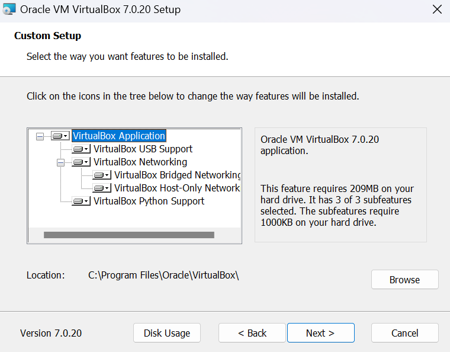
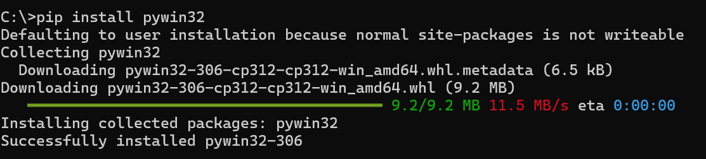
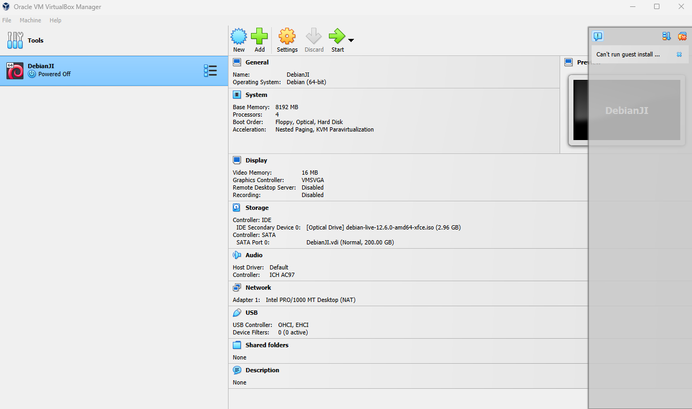
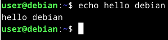
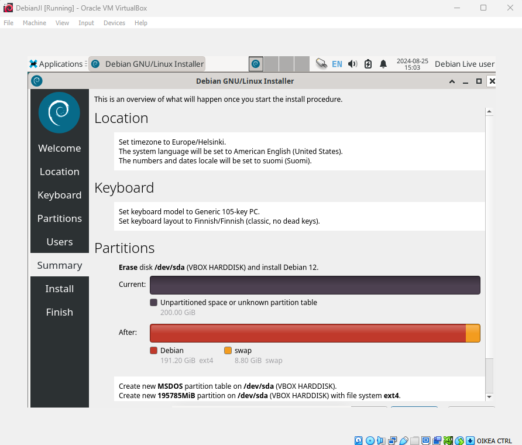
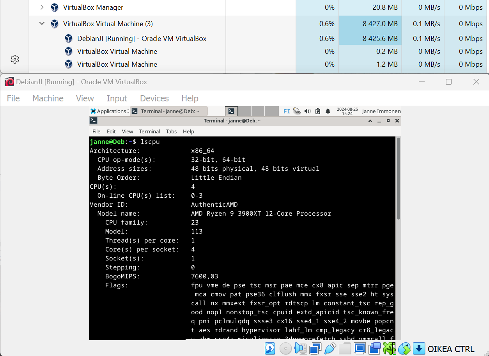
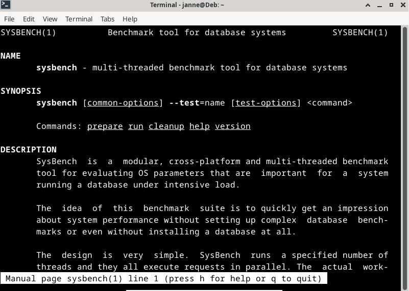
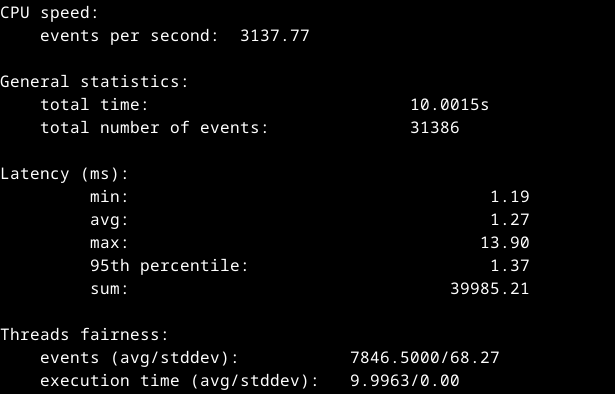

# h1 Oma Linux

## x) FSF Free Software Definition

Free Software Foundation määrittää vapaan ohjelmiston ohjelmistoksi, jota voi ajaa, muokata, tutkia, kopioida, ja julkaista haluamallaan tavalla.
Edellytys tälle on pääsy lähtekoodiin.

### Vapaan ohjelman kaupallisuus

Oikeus käyttää ohjelmaa kaupallisesti on turvattava tai se ei ole vapaa ohjelma.
Tämän on looginen tulkinta vapaudesta, mutta voi aiheuttaa hämmennystä jos vapaan (eng. free) tulkitsee ilmaiseksi.

Tämän tulkinnan taustalla on myös tavoita levittää vapaata ohjelmaa ja lopulta saada se korvaamaan ei-vapaat vaihtoehdot. Tämän toteutuminen on mahdotonta, jos vapaata ohjelmaa ei saa käyttää kaupallisesti.

### Vapaalle ohjelmalle hyväksyttävät jakelusäännöt
On olemassa joitain ohjelman jakeluun liittyviä sääntöjä, esimerkiksi Copyleft, joiden FSF katsoo olevan hyväksyttäviä vapaassa ohjelmassa.
Pelkistetysti Copyleft tarkoittaa, että uudelleenjaettessa ohjelmaa sen keskeisiä vapauksia ei saa rajoittaa.

Myös säännöt ohjelman uudelleenjakelusta, kuten kielto julkaista muokattua versiota samalla nimellä, ovat hyväksyttäviä, jos ne eivät oleellisesti rajoita vapautta julkaista tai rakentaa muokattuja versioita.

### Vapaan ohjelman määritelmä käytännössä
Kriteerien tulkitseminen vapaalle ohjelmalle edellyttää tarkkaa harkintaa ja  FSF katsoo, että ohjelman on noudatettava vapaan ohjelman periaatteita myös hengessä tarkoin määriteltyjen sääntöjen lisäksi.

### Vapaan softan tuolla puolen
FSF:n mukaan myös vapaan ohjelmiston manuaalien on oltava vapaita, koska ne ovat de facto osa ohjelmistoa.
Vapaan ohjelman määritelmän voi myös jatkaa samoilla periaatteilla kattamaan ohjelmien ulkopuolisia asioita.

## a) Asenna Linux virtuaalikoneeseen

Ympäristö: Windows 11 Education 23H2 käyttöjärjestelmä, AMD Ryzen 3900XT prosessori, 32GB muistia

Latasin VirtualBox 7.0.20 exen ja Debian live 12.6.0 imagen koneelle.
Lähdin asentamaan VirtualBoxia kaikilla ominaisuuksilla. Keskeytin ensimmäisen asennuksen asentaakseni puuttuvat riippuvuudet Python tukeen.

Asensin puuttuvat riippuvuudet ja asensin VirtualBoxin kaikilla ominaisuuksilla.

Tein uuden virtuaalikoneen VirtualBoxiin seuraavilla asetuksilla:

Boottasin Debianin live version ja varmistin hiiren, näppäimistön ja internet yhteyden toimivuuden, sekä ajoin yksinkertaisen komennon shellissä.

Asensin Debianin seuraavilla asetuksilla:

Boottasin virtuaalikoneen ja varmistin koneen speksien olevan oikein.

Prosessissa meni kokonaisuudessaan 1h 10min ja ainoa vastaan tullut ongelma oli puuttuva riippuvuus virtualboxin hallinnointiin Python scripteillä (todennäköisesti turha ominaisuus, mutta asensimpa kuitenkin), jonka selvittäminen tapahtui muutamassa minuutissa.

## x)Vapaaehtoinen bonus: suosikkiohjelmani Linuxilla. Tee ja raportoi jokin yksinkertainen toimenpide haluamallasi Linux-ohjelmalla.

Hain Googlesta tietoa Linux CPU testeistä ja päädyin Sysbench ohjelmaan.

Sysbench install:

Sysbench manuaali (man sysbench komento):

Testin asetukset (neljän ytimen testi):

Testitulokset:

Yhteenvetona voin todeta, etten osannut tulkita testituloksia, mutta koska virtuaalikone tai sitä pyörittävä pöytäkone eivät kaatuneet, pidin sitä onnistuneena.

## Lähteet
Tehtävä: https://terokarvinen.com/linux-palvelimet/#h1-oma-linux

FSF - What is Free Software: https://www.gnu.org/philosophy/free-sw.html

Ohjeet: https://terokarvinen.com/2021/install-debian-on-virtualbox/

Debian image: https://cdimage.debian.org/debian-cd/current-live/amd64/iso-hybrid/debian-live-12.6.0-amd64-xfce.iso

VirtualBox lataussivu: https://www.virtualbox.org/wiki/Downloads

Sysbench benchmark ohjelma: https://github.com/akopytov/sysbench
