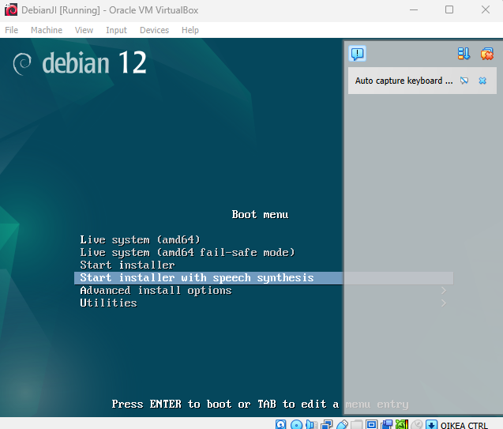
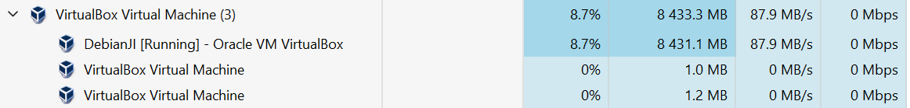

# h1 Oma Linux

x) FSF Free Software Definition

FSF määrittää vapaan ohjelmiston ohjelmistoksi, jota voi ajaa, muokata, tutkia, kopioida, ja julkaista haluamallaan tavalla.
Edellytys tälle on pääsy lähtekoodiin.

a) Asenna Linux virtuaalikoneeseen

Ympäristö: Windows 11 Education käyttöjärjestelmä, AMD Ryzen 3900XT prosessori, 32GB muistia

Latasin VirtualBox 7.0.20 exen ja Debian live 12.6.0 imagen koneelle.

Lähdin asentamaan VirtualBoxia kaikilla ominaisuuksilla. Keskeytin ensimmäisen asennuksen asentaakseni puuttuvat riippuvuudet Python tukeen.

Asensin puuttuvat riippuvuudet ja asensin VirtualBoxin kaikilla ominaisuuksilla.

Tein uuden Virtuaalikoneen VirtualBoxiin seuraavilla asetuksilla:

Boottasin Debianin ja testasin live versiossa hiiren, näppäimistän ja internet yhteyden toimimisen, sekä ajoin yksinkertaisen komennon shellissä.

Asensin Debianin asetuksilla:

resurssienkulutus asennuksen aikana
Boottasin virtuaalikoneen ja varmistin koneen speksien olevan okein

## Lähteet
Tehtävä: https://terokarvinen.com/linux-palvelimet/#h1-oma-linux
Ohjeet: https://terokarvinen.com/2021/install-debian-on-virtualbox/
Debian image: https://cdimage.debian.org/debian-cd/current-live/amd64/iso-hybrid/debian-live-12.6.0-amd64-xfce.iso
VirtualBox lataussivu: https://www.virtualbox.org/wiki/Downloads
