# h3 Komentaja Pingviini

## Komentorivin perusteet
Teksti on tiivistetty Tero Karvisen 2020 artikkelista Command Line Basics Revisited

Linuxissa käytetty komentorivi on kätevä, nopea, ilmaisuvoimainen ja helposti automatisoitava.

## Muutamia komentoja kategorioittain
### Liikkuminen ja katselu
Komentorivia käytettäessä ollaan aina jossain kansiossa. Tämänhetkistä kansiota kutsutaan työskentelykansioksi (working directory).
- `$ pwd` - Tulosta töskentelykansio.
- `$ ls` - Listaa kansion tiedostot.
- `$ cd` - Liiku kansiosta, esim. `$ cd ../esimerkki` liikkuakseen yhtä ylemmässä kansiossa sijaitsevaan esimerkki nimiseen kansioon.
- `$ less` - Näyttää tekstin ruudun kokoisina palasina "less-avaruudessa" omilla navigaatiotyökaluillaan. Minkä vain tulosteen voi putkittaa lessiin 
### Tiedostojen muokkaus
- `$ nano FOO.TXT` - Avaa FOO.TXT tiedoston nano tekstinkäsittelyohjelmalla, tai jos tiedostoa ei ole, avaa nano editorin uudelle tiedostolle ja tallentamisen yhteydessä FOO.TXT luodaan.
- `$ mkdir` - Luo kansio.
- `$ mv` - Liikuta tai uudelleen nimeä tiedosto.
- `$ cp` - Kopioi tiedosto tai `$ cp -r` kopioi kansio sisältöineen.
- `$ rmdir` - Tuhoa tyhjä kansio.
- `$ rm` - Tuhoa tiedosto tai `$ rm -r` tuhoa kansio sisältöineen.
### SSH Etäyhteys
Terminaalista voi ottaa Secure Shellillä etäyhteydän toiseen koneen terminaaliin.
- `$ ssh tero@example.com` - Avaa etäyhteyden ja terminaalin kohdekoneeseen.
- `remotemachine$ exit` - Poistuu terminaalista.
- `$ $ scp -r FOLDER tero@example.com:public_html/` - Turvallisesti kopioi kansion omalta koneelta etäkoneelle. SCP ajetaan omalta koneelta, eli etäyhteys on suljettava ensin.
### Apu
Ohjeita ohjelmien käytöstä voi lukea niiden manuaalisivulta tai moniin ohjelmiin sisältyväv, usein suppeamma, apusivun kautta.
- `$ man` - Avaa manuaalisivun, esim - `$ man ls` ls:n manuaalille.
- `$ ls --help` Avaa komentoon sisältyvän helpin.
### Historia ja Arvailu
Tabillä voi automaattisesti viimeistellä aloitetun komennon ja kahdesti painamalla saa listan saatavilla olevista komennoista (sekä vavhistusruudun jos tuplatabin painaminen ei välttämättä ollut kyseisessä tilanteessa mielekästä). 

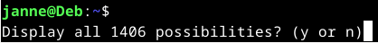
### Tärkeät Kansiot
Kaikkien Linuxien kansirakenteet ovat Filesystem Hierarchy Standardard mukaisia, eli kansiorakenne on sama distrosta riippumatta.
- `/` - Juurihakemisto hakemistorakenteen huipulla. Kaikki muu on tämän alla.
- `/home/` - Sisältää kaikkien käyttäjien kotihakemistot.
- `/home/tero/` - Sisältää tero nimisen käyttäjän kotihakemiston ja on ainoa paikka, jonne tero voi pysyvästi tallentaa dataa.
- `/etc/` - Sisältää kaikki järjestelmän laaljuiset asetukset.
- `/media/` - Sisältää irrotettavan median kuten usb-tikut ja levy-mediat.
- `/var/log/` - Sisältää järjestelmän laajuiset logit.
### Hallinnolliset Komennot
Pienimmän käyttäjäoikeuden periaate (eng. minimum privilege principle) sanoo, että operaatiot suoritetaan alimman mahdollisen tason käyttäjäoikeuksilla. Täten ainoastaan operaatiot, jotka tarvitsevat laajoja käyttäjäoikeuksia tulee suorittaa 'sudo':na, jolloin ne saavat rajattomat oikeudet.
Tälläisiä ovat koko järjestelmään vaikuttavat operaatiot, kuten ohjelmien asennus ja poisto sekä käyttäjien luonto ja käyttäjäoikeuksien hallinnointi.
Siispä `$ sudo apt-get update`, joka päivittää listan saatavilla olevista pakeista tarvitsee sudo (super user do) oikeudet, mutta  `$ apt-cache search`, joka etsii paketteja ei tarvitse.

## Raportti
## Ympäristö
### Rauta: 
- Käyttöjärjelmä: Windows 11 Education x86-64 23H2
- Prosessori: AMD Ryzen 3900XT 3.9GHz 12-core
- RAM: 32GB
- Näytönohjain: Nvidia Geforce 3080 RTX
- Kiintolevy: Samsung 2 TB M.2 SSD
### Virtuaali:
- Virtualisointi: VirtuaBox 7.0.20
- Käyttöjärjestelmä: Debian 12 x86-64
- CPU: 4 core
- RAM: 8GB
- Kiintolevy: 200 GB

Tehtäviä suoritteassani minulla oli ajastin pyörimässä, mutta tähtävän sisällä eri osioihin käytetty aika on ainoastaan rehellinen arvioni, koska tarkempaa mittausta en tehnyt.

## a) Micro. Asenna micro-editori.
Käytetty aika: 12 minuuttia. ~5 minuuttia tehtävään ja ~7 minuuttia raporttiin sekä kuvakaappauksiin.

Ajoin `sudo apt-get update` ja `sudo apt-get install micro` komennot. Hyväksyin xclipin asennuksen, josta promptattiin ennen asennuksen alkua.
Katsoin micron kuvauksen `man micro` komennolla ja loin kokeeksi tekstitiedoston. Tämän jälkeen selvitin micron näppäinyhdistelmät painamalla `Alt-g`, jonka jälkeen tallensin tiedoston ja poistun microsta.

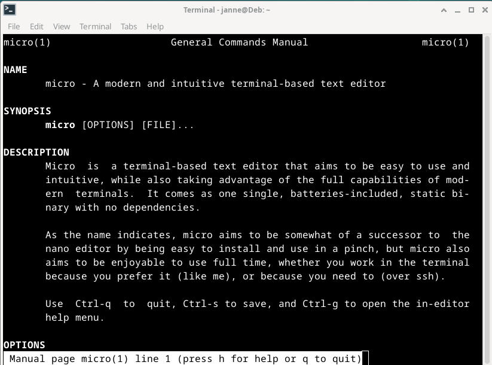
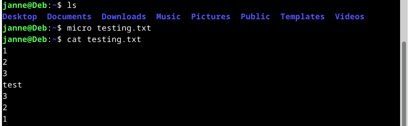

## b) Apt. Asenna kolme itsellesi uutta komentoriviohjelmaa. Kokeile kutakin ohjelmaa sen pääasiallisessa käyttötarkoituksessa. Ota ruutukaappaus. Kaikki terminaaliohjelmat kelpaavat, TUI (text user interface) ja CLI (command line interface). Osaatko tehdä apt-get komennon, joka asentaa nämä kolme ohjelmaa kerralla?
Käytetty aika: 34 minuuttia. ~10 minuuttia tiedonhakuun Linux CLI ohjelmista, ~15 minuuttia tehtävään, ~9 minuuttia kuvakaappauksiin ja raporttiin.

Päädyin ohjelmiin Wget, lshw ja tldr. Wget ja lshw tulivat vastaan viikon materiaalissa ja tldr:en löysin googlettamalla Linuxiin suositeltuja CLI ohjelmia.

Wget on ei-interaktiivinen ohjelma tiedostojen lataamiseen netistä, lshw on työkalu koneen rauta-informaation selvittämiseen ja tldr (too long; didn't read) on yhteysövoimin ylläpidetty ohjelma, joka tarjoaa lyhennetyt ja `man` komentoa helpommin luettavat manuaalisivut eri ohjelmille.

Varmistin kaikkien löytymisen `apt-cache search` komennoilla. Ajoin `sudo apt-get install wget lshw tldr` ja hyväksyin tarvittavien riippuvuuksien asennuksen promptatessa.

Ensiksi ajoin `tldr tldr` komennon, joka ensin haki tldr manuaalitiedostot (`tldr --update` olisi tehnyt saman) ja sen jälkeen näytti tldr:n tldr sivun.
Seuraavaksi hain Wgetin tldr sivun ohjeeksi ohjelman käytöstä.

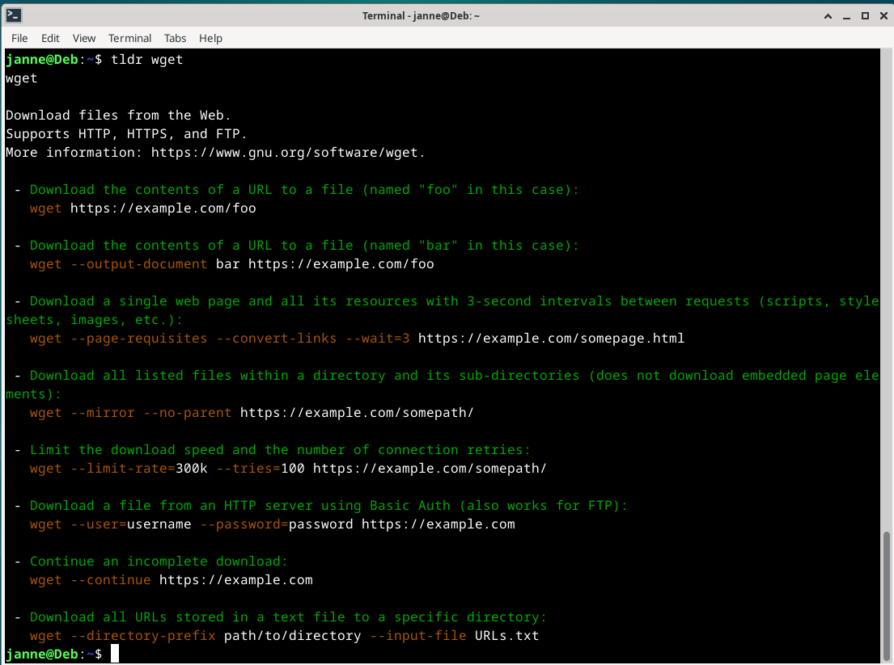

Wgetin tldr ohjeita noudattaen latasin erään ensimmäisen viikon läksyjen kuvista, joka toisella yrityksellä onnistui kun sain kirjoitettua komennon oikein.

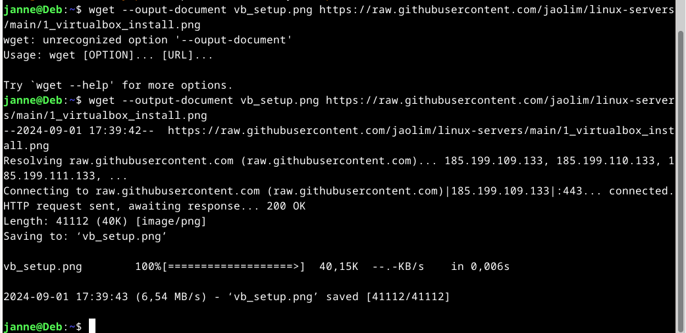

Katsoin lshw:n tldr sivun `tldr lshw` komennolla ja nappasin sieltä komennon `sudo lshw -short` koneen raudan listaukseen.

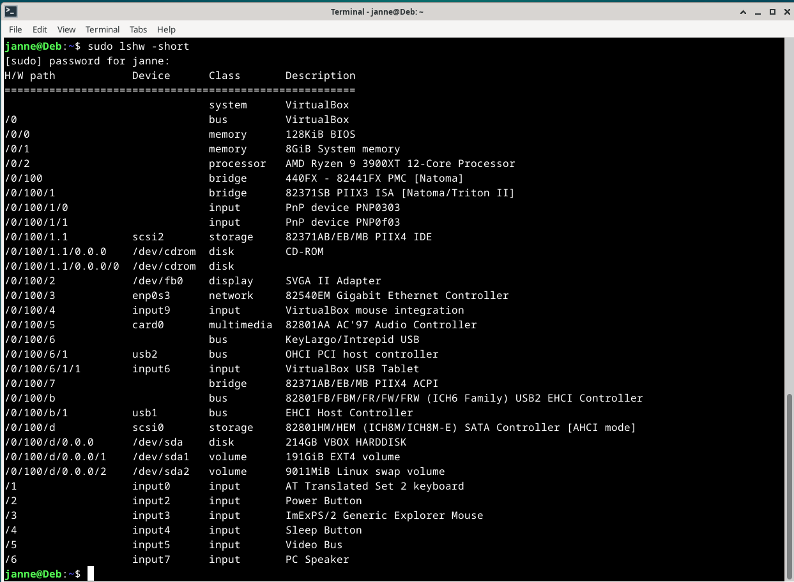

## c) c) FHS. Esittele kansiot, jotka on listattu "Command Line Basics Revisited" kappaleessa "Important directories". Näytä kuvaava esimerkki kunkin tärkeän kansion sisältämästä tiedostosta tai kansiosta. Jos kyseessä on tiedosto, näytä siitä kuvaava esimerkkirivi. Työskentele komentokehotteessa ja näytä komennot, joilla etsit esimerkit.
Käytetty aika: 23 minuuttia. ~10 minuuttia tehtävään, ~13 minuuttia kuvakaappauksiin ja raporttiin.
Juurikansio (/) on järjestelmän ylin kansio, jonka alta kaikki muut löytyvät.

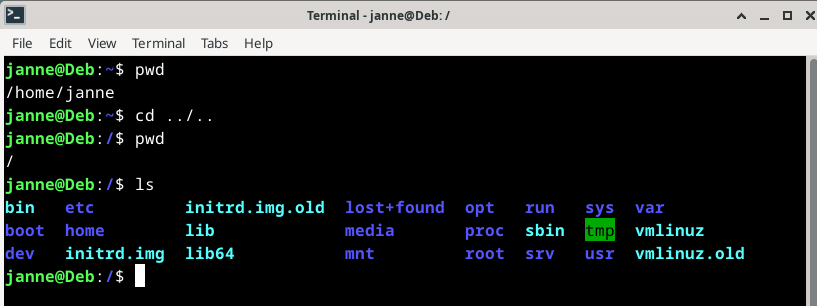

Home (/home/) kansio sisältää kaikkien käyttäjien kotikansiot.

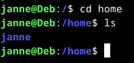

Janne (/home/janne/) kansi on janne nimisen käyttäjän kotikansio.

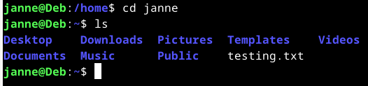

Etc (/etc/) sisältää järjestelmänlaajuiset asetukset.

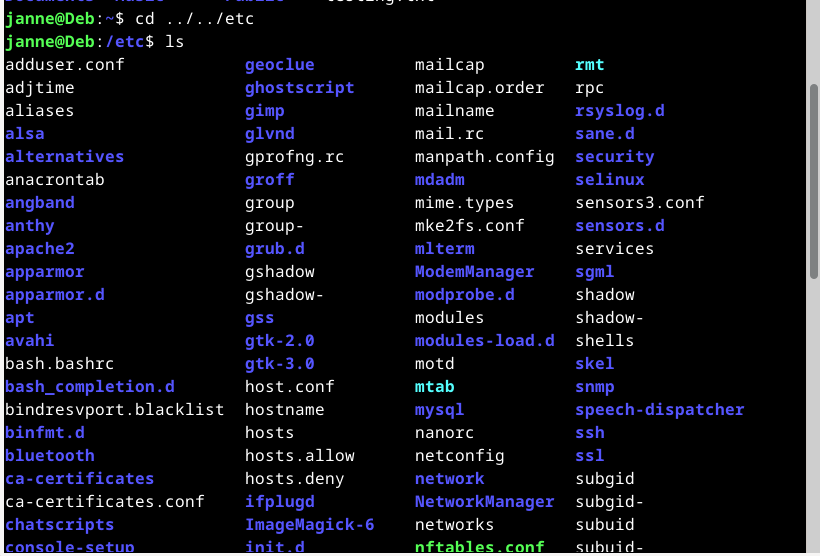

Media (/media/) sisältää irtomedian. Tällä hetkellä virtuaaliseen cd asemaan mountattu asennuslevy virtual box Guest Additionsille.

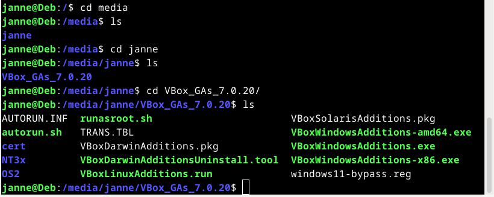

Log (/vafr/log/) sisältää järjestelmänlaajuiset logitiedostot.

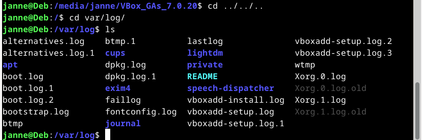
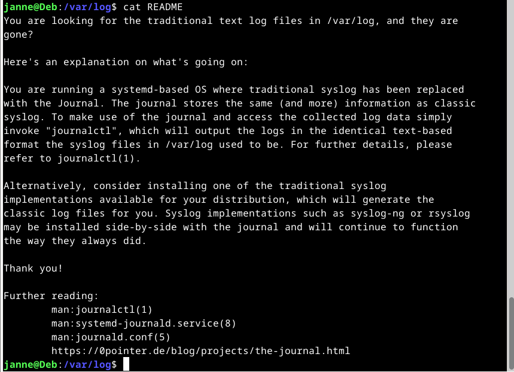

## d) The Friendly M. Näytä 2-3 kuvaavaa esimerkkiä grep-komennon käytöstä. Ohjeita löytyy 'man grep' ja tietysti verkosta.
Käytetty aika: 31 minuuttia. ~15 minuuttia tiedon hakuun ja manuaalisivujen tutkimiseen, ~10 tehtävän suorittamiseen, ~6 raporttiin ja kuvakaappauksiin.

Ajoin ensiksi `tldr grep`(olisi todennäköisesti suositeltavaa opetella `man` käyttö kohtuullisesti ennen oikoteiden käyttöä, mutta tämä on tulevan itseni ongelma).

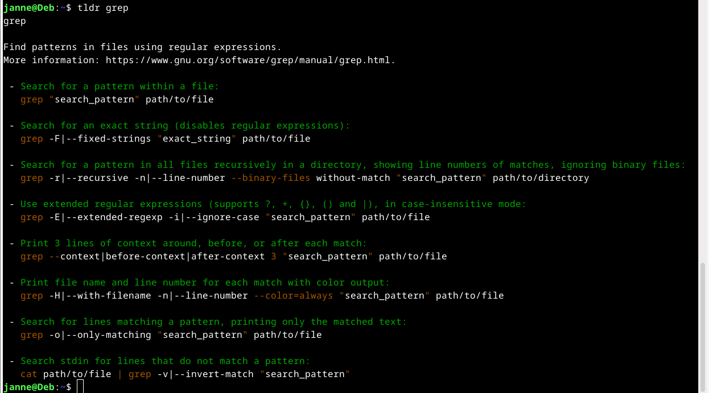

Navigoin /etc/ kansioon ja katsoin os-release tiedoston sisältöä `cat os-release`, jonka jälkeen kirjoitin komennon, joka hakee rivit, jotka sisältävät hakutermin "NAME". Pelkästään hakutermin sisältävien rivien tulostus vaati kaksi yritystä syntaksin saamiseksi oikein.

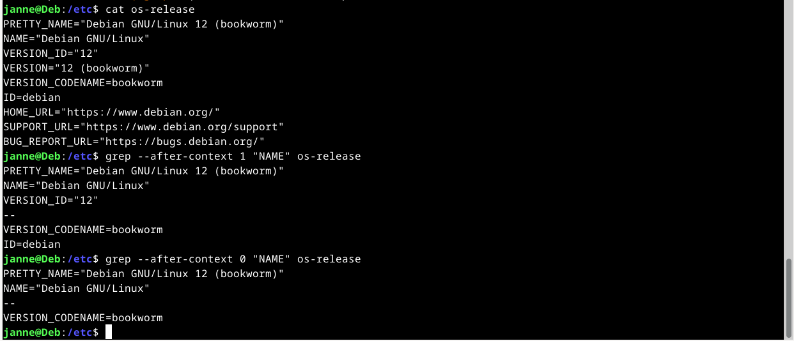

Putkitin grepin manuaalisivun grepin komentoon tietyn rivin etsimiseksi löytääkseni edellisen komennon kuvauksen paikan grepin manuaalista komennolla `man grep | grep -n "before-context"`.

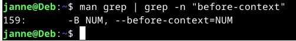

Tämän jälkeen ajoin `grep man` ja navigoin kyseiselle sivulle.

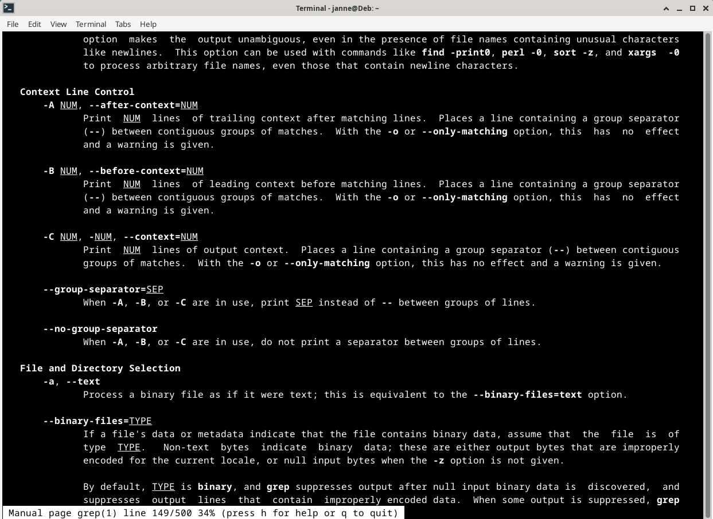

Tulostin tiedoston testing.txt sisällön komennolla `cat testing.txt`, jonka jälkeen tulostin rivejä muutamalla grepin -E (extended-regexp) komennon parametrilla.

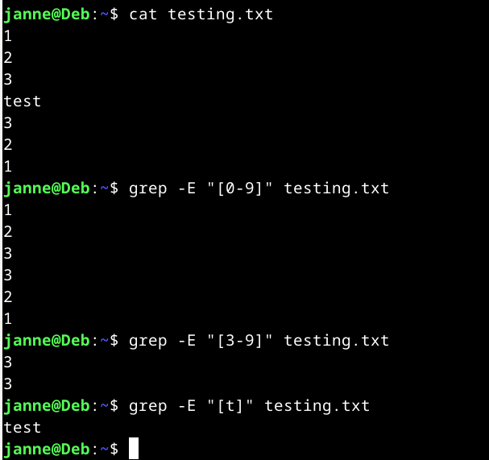

## e) Pipe. Näytä esimerkki putkista (pipes, "|").
Käytetty aika: 10 minuuttia. ~5 minuuttia tiedonhakuun putkituksen ja uudelleenohjauksen syntakstiksta, ~1 minuutti tehtävään, ~4 minuuttia kuvankaappauksiin ja raporttiin.

Loin uuden tyhjän tekstitiedoston komennolla `touch result.txt`, jonka jälkeen käytin `echo qwerty12345 you12 me they` komentoa tulostamaan parametraina annetut sanat ja putkitin tämän grepin only matching hakuun parametrille y `grep -o "y"` ja ohjasin lopputuloksen aikasemmin luotuun tekstitiedostoon `>> result.txt`.
Lopuksi vielä varmistin vain y kirjainten kopioituneen komennolla `cat result.txt`.

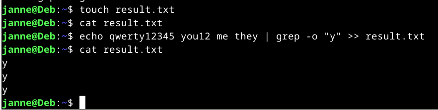

## f) Rauta. Listaa testaamasi koneen rauta (‘sudo lshw -short -sanitize’). Asenna lshw tarvittaessa. Selitä ja analysoi listaus.
Ajankäyttö: 16 minuuttia. ~11 minuuttia hakuja lshw tulosten tulkitsemista (ei lopulta vaikutusta vastaukseen, mutta totesin, että tulosten syvempi tulktiseminen ei ole triviaalia, erityisesti jos ei tiedä täsmälleen mitä hakea), ~2 minuuttia tehtävään, ~3 minuuttia kuvakaappauksiin ja raporttiin.

Uudelleenohjasin annetun komennon tulosteen tiedostoon hardware.txt ja tulostin sen terminaalin catillä.

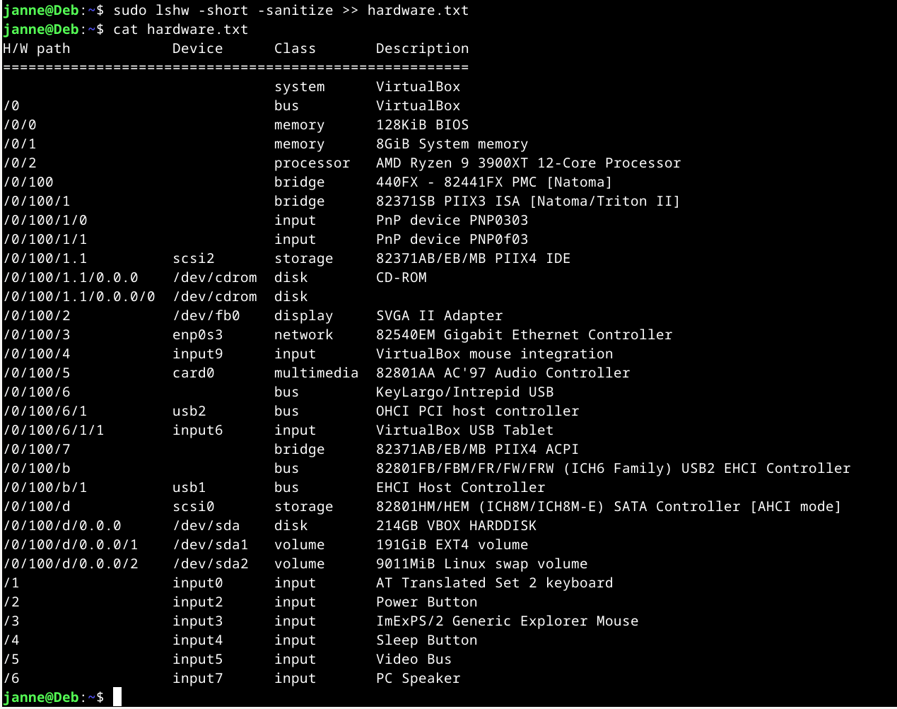

Osasta laitteista, kuten prosessori, näki virtuaalinen Linux alle pyörivän raudan mallin, mutta valtaosa näkyi virtualboxin tarjoamina virtualisointeina. Muistissa ja kovalevytilassa näkyivät vain virutaalikoneelle allokoidut määrät. Ajaessa `lscpu` komennon näkyi myös prosessorin osalta ytimien määrän myös oikein. Tarkemmin en osannut tulkita tuloksia.

## g) Vapaaehtoinen: Valitse muutama rivi lokeista. Tulkitse ja analysoi.
Ajankäyttö: 10 minuuttia. ~5 minuuttia tehtävään ja ~5 minuuttia kuvankaappauksiin ja raporttiin.

Navigoin oikeaan hakemistoon.

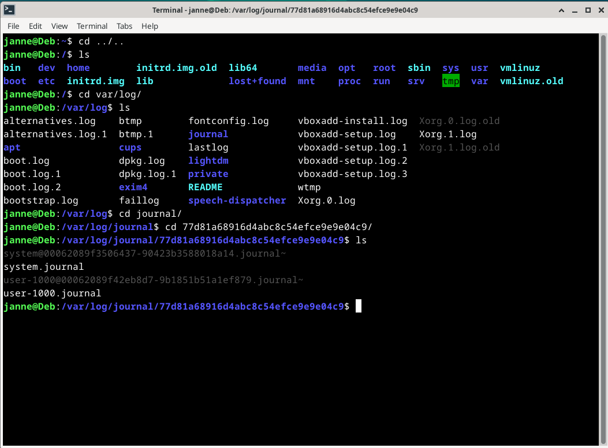

Tämän jälkeen yritin lukea yhtä .journal tiedostoa catillä ja totesin, ettei binääritiedoston lukeminen teksinä ole mielekästä ja noudatin c) tehtävän log readmessä vastaan tullutta ohjetta ajaa `journalctl`. Journalctl:ssa scrollasin loppupäähän ja kaivoin login koskien aikaisemman tehtävän sudona ajettua `lshw` komentoa. Login perusteella sudona ajettu komento tekee juurikäyttäjälle session, jossa komento ajetaan ja jonka jälkeen sessio suljetaan.

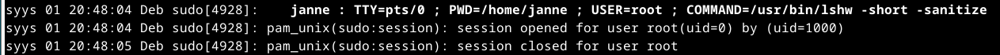

## h) Vapaaehtoinen: Asenna jokin plugin micro-editorille ja kokeile sitä. Vaikkapa palettero, cheat tai runit.
Ajankäyttö: 56 minuuttia. ~20 minuuttia tiedonhakuun plugineista, ~5 minuuttia pluginin testeihin toimivilla asetuksilla, ~25 minuuttia vianselvitykseen MarkDowniin liittyvässä ongelmatilanteessa, ~6 kuvankaappauksiin ja raporttiin.

Asensin ensin jump pluginin tarvitsemat riippuvuudet, jonka jälkeen tein jumptest.md tiedoston MarkDown navigoinnin testaamiseksi.

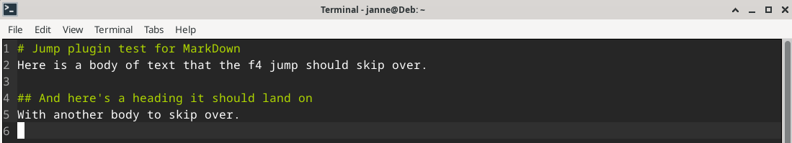

F4 painamalla jump navigointiruutu kuitenkaan ei tunnistanut tiedoston otsikoita.

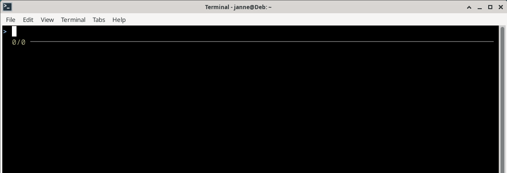

Seuraavaksi tein .js tiedoston navigointikoilua varten.

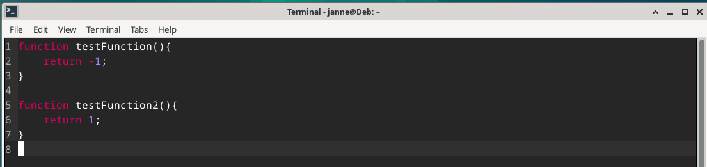

Tässä tiedostossa navigointi toimi.

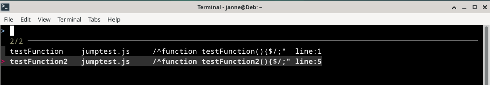

Seuraavaksi lähdin selvittämään ongelmaa MarkDownin kanssa. 

Projektin githubissa annettu komento `$ cp -nv $HOME/.config/micro/plug/micro-jump/examples/ctags $HOME/.ctags` aiheutti valitusta puuttuvasta tiedostosta, joten navigoin läpi kansiorakennetta selvittämään virhettä, ja virheen löydettyäni korjasin sen muotoon `$ cp -nv $HOME/.config/micro/plug/jump/examples/ctags $HOME/.ctags`.

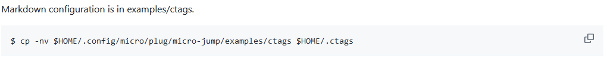
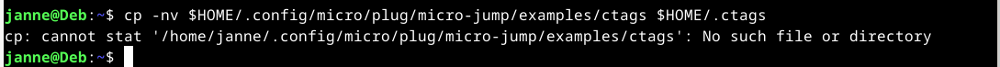

Kopioituani tiedoston onnistuneesti katselin sisältöä `cat` komentoa käyttäen.

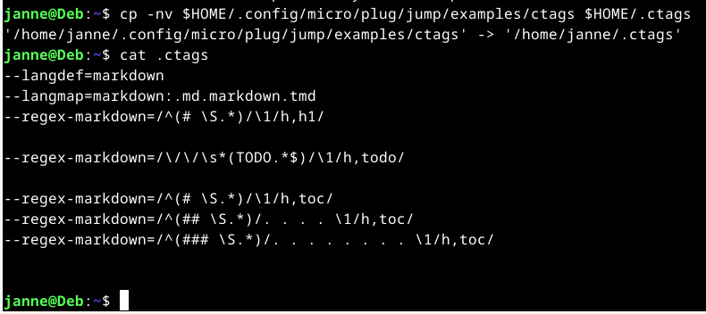

Tämän jälkeen loin uuden testitiedoston tismalleen github sivun ohjeiden mukaisesti ja navigointi toimi.

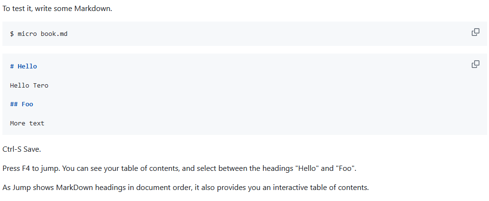
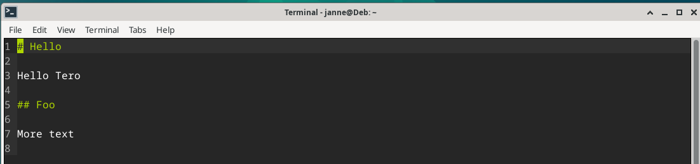
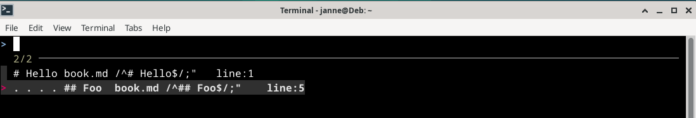

Navigointi toimi nyt myös vanhassa jumptest.md tiedostassa, eli ongelma oli käyttäjän kotihakemistosta puuttunut .ctags tiedosto.

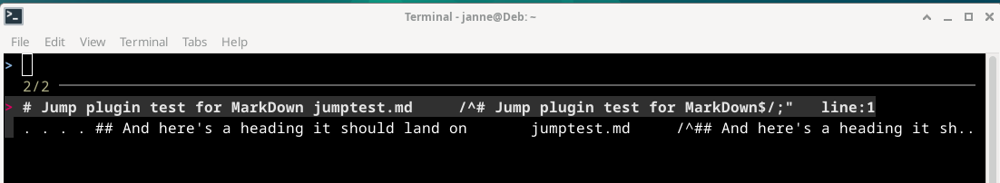

## Lähteet

Karvinen, Tero. 2020. Command Line Basics Revisited. https://terokarvinen.com/2020/command-line-basics-revisited/

Karvinen, Tero. 2024. h2 Komentaja Pingviini. https://terokarvinen.com/linux-palvelimet/#h2-komentaja-pingviini

tldr projektin github sivu: https://github.com/tldr-pages/tldr

Karvinen, Tero. 2022. Micro-jump. https://github.com/terokarvinen/micro-jump

## Lisenssi
Sivun sisältöä saa levittää GPL-3.0 lisenssin sallimin ehdoin: https://github.com/jaolim/linux-servers?tab=GPL-3.0-1-ov-file#readme
