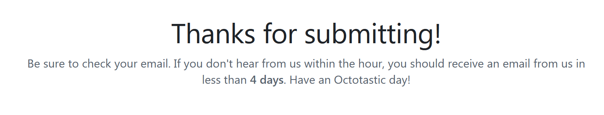

# h3 Hello Web Server

> ## Ympäristö
> ### Rauta: 
> - Käyttöjärjelmä: Windows 11 Education x86-64 23H2
> - Prosessori: AMD Ryzen 3900XT 3.9GHz 12-core
> - RAM: 32GB
> - Näytönohjain: Nvidia Geforce 3080 RTX
> - Kiintolevy: Samsung 2 TB M.2 SSD
> ### Virtuaali:
> - Virtualisointi: VirtuaBox 7.0.20
> - Käyttöjärjestelmä: Debian 12 x86-64
> - CPU: 4 core
> - RAM: 8GB
> - Kiintolevy: 200 GB

## x) Lue ja tiivistä: [Name-based Virtual Host Support](https://httpd.apache.org/docs/2.4/vhosts/name-based.html), [Name Based Virtual Hosts on Apache – Multiple Websites to Single IP Address](https://terokarvinen.com/2018/04/10/name-based-virtual-hosts-on-apache-multiple-websites-to-single-ip-address/)
Toisin kuin IP-pohjaisessa virtuaalihostissa, jossa yksi host on sidottu yhteen IP-osoitteeseen, voi nimi pohjainen virtual host voi pitää useita eri hosteja samassa IP-osoitteessa ohjaten liikenteen oikeaan hostiin http headerin nimitiedon perusteella.

VirtualHost tulee luoda jokaiselle hostille, jota palvelimella on tarkoitus pitää ja niille täytyy vähintään määritellä `ServerName` hostin tunnistamiseksi ja `DocumentRoot` hostin sisällön sijainnin määrittämiseksi. 

Askeleet virtual hostin tekemiseen apache2 palvelimella (käyttäen xubuntu käyttäjää ja pyora.example.com sivua esimkerkeissä):
- Asenna apache ja korvaa oletusetusivu polussa `/var/www/html/index.html`
- Lisää uusi nimi pohjainen virtual host polkuun: `/etc/apache2/sites-available/pyora.example.com.conf`

```
#.conf tiedoston sisältö
<VirtualHost *:80>
  ServerName pyora.example.com
  ServerAlias www.pyora.example.com
  DocumentRoot /home/xubuntu/publicsites/pyora.example.com
  <Directory /home/xubuntu/publicsites/pyora.example.com>
    Require all granted
  </Directory>
</VirtualHost>
```
- Tee webbisivu normaalikäyttäjänä DocumentRootissa määriteltyyn polkuun
- Testaa webbisivua `curl -H 'Host: pyora.example.com' localhost`

Oikeassa elämässä sivun nimi vuokrattaisiin palveluntarjoajalta, mutta harjoituskäytössä voidaan käydä muokkaamassa `etc/hosts`.

## Raportti

### a)Testaa, että weppipalvelimesi vastaa localhost-osoitteesta. Asenna Apache-weppipalvelin, jos se ei ole jo asennettuna.
Käytetty aika: alle minuutti.

Avasin Firexosin ja otin yhteyden localhost osoitteeseen ja sain apachen oletussivun näkyville.


### b) Etsi lokista rivit, jotka syntyvät, kun lataat omalta palvelimeltasi yhden sivun. Analysoi rivit (eli selitä yksityiskohtaisesti jokainen kohta ja numero, etsi tarvittaessa lähteitä).
Käytetty aika: 55 minuuttia, ~20 minuuttia logien kaivamiseen ja kopiointiin, ~35 minuuttia logien tulkitsemiseen ja aukikirjoittamiseen.

Etsin ensin apache2 logien sijainnin ja huomattuanu kansioon navigoinnin vaativan pääkäyttäjän oikeudet katselin sisältöä `sudo ls -a apache2` komennolla.


Tämän jälkeen valitsin nimen perusteella access.log tiedoston tarkempaan tutkisteluun ja ajoin sudo cat apache/access.log saadakseni login sivun latauksesta.


Etsin logien tulkitsemiseen apuvälineeksi [Apachen dokumentaation aiheesta](https://httpd.apache.org/docs/current/logs.html).

Tein myös kopion logeista saadakseni ne ulos virtuaaliympäristöstä, mutta päädyin lopulta tiedoston siirron sijaan käyttämään clipboardia.


Ensimmäinen rivi: `127.0.0.1 - - [06/Sep/2024:18:20:32 +0300] "GET / HTTP/1.1" 200 3380 "-" "Mozilla/5.0 (X11; Linux x86_64; rv:109.0) Gecko/20100101 Firefox/115.0"`

- `127.0.0.1` Client IP-osoite
- `-` Puuttuva tieto clientistä (RFC 1413 identity)
- `-` Puuttuva tieto clientistä (userid HTTP authentication määrittelemänä)
- `[06/Sep/2024:18:20:32 +0300]` Pyynnön saapumishetki 
- `"GET` Clientin käyttämä metodi
- `/` Pyydetty resurssi
- `HTTP/1.1"` Clientin käyttämä protokolla
- `200` Palvelimen palauttama statuskoodi (200=OK)
- `3380` Lähetyksen koko biteissä
- `"-"` Puuttuva tieto (Sivu, jolta client on ohjattu)
- `"Mozilla/5.0 (X11; Linux x86_64; rv:109.0) Gecko/20100101 Firefox/115.0"` User-Agent HTTP request header eli tietoa käyttäjän ympäristöstä

Toinen rivi (vain erot avattu tarkemmin): `127.0.0.1 - - [06/Sep/2024:18:20:32 +0300] "GET /icons/openlogo-75.png HTTP/1.1" 200 6041 "http://localhost/" "Mozilla/5.0 (X11; Linux x86_64; rv:109.0) Gecko/20100101 Firefox/115.0"`
- `/icons/openlogo-75.png` Pyydetty resurssi (kuva logosta) 
- `6041` Lähetyksen koko (suurempi kuin muu sivu kokonaisuudessaan)
- `"http://localhost/"` Sivu, jolta client on ohjattu

Yhteydenotto sivuun aiheutti kaksi tapahtumaa, joissa olivat pääosin identtiset tiedot clientistä. Ensimmäinen oli sivun lataus ja toinen sivulla olevan `</img>` tageillä ympäröidyn kuvan lataus, jossa sivu toimi itse referoijana.

### c) Etusivu uusiksi. Tee uusi name based virtual host. Sivun tulee näkyä suoraan palvelimen etusivulla http://localhost/. Sivua pitää pystyä muokkaamaan normaalina käyttäjänä, ilman sudoa. Tee uusi, laita vanhat pois päältä. Uusi sivu on hattu.example.com, ja tämän pitää näkyä: asetustiedoston nimessä, asetustiedoston ServerName-muuttujassa sekä etusivun sisällössä (esim title, h1 tai p).
Ajankäyttö: 1h 10min, ~20min dokumentaation lukemiseen, ~30 min ensimmäisen sivun kirjoittamiseen ja konfigurointiin, ~20 puuttuineiden vaiheiden tekemiseen.

Lähdin seuraaman [Karvisen 2018 ohjeita](https://terokarvinen.com/2018/04/10/name-based-virtual-hosts-on-apache-multiple-websites-to-single-ip-address/) ja ensimmäisenä loin .conf tiedoston.


Tämän jälkeen tein index.html tiedoston oikean polkurakenteen päähän.


`curl -H 'Host: mina.itse.com' localhost` kuitenkin antoi default sivun edelleen, joten katsoin ohjetta tarkemmin ja ajoin välistä unohtuneet komennot, jonka jälkeen uusi sivu näkyi.


Varmistin mina.itse.comin toimivan.


Tässä kohtaan luin tehtävänannon uudestaan, ja tajusin, että tarkoituksena olikin korvata localhost osoitteessa näkyvä sivu.

Aikaisempia askeleita seuraten loin uuden virtual hostin ja tein oikeaan polkurakenteeseen uuden index.html tiedoston.


*Kuvattu Virtual Hostin asetustiedosto, sivun sisällön käyttäjäoidet(omistajalla luku ja kirjoitusoikeudet) ja sivu avattuna webbiselaimessa.*

Luin vielä tarkemmin tehtävän antoa ja kävin tekemässä ohi hypätyn askeleen "laita vanhat pois päältä" deaktivoimalla oletussivun.


### e) Tee validi HTML5 sivu.
*Tehtävänannossa hypättiin d:n yli*

Ajankäyttö: 10 minuuttia, ~5 minuuttia tehtävään, ~5 minuuttia raporttiin

Käytin materiaalissa annettua [html validoijaa](https://validator.w3.org).

Kopioin aikaisemman tehtävän example.hatun index.html tiedoston sisällön validoijaan.


Korjasin molemmat validoijan huomautukset, vaikka kielen merkkaus noin lyhyessä sivussa on täysin turhaa ja validoinnin mentyä läpi ilman huomautuksia tein samat korjaukset myös toiseen tekemääni sivuun.


### f) Anna esimerkit 'curl -I' ja 'curl' -komennoista. Selitä 'curl -I' muutamasta näyttämästä otsakkeesta (response header), mitä ne tarkoittavat.
Käytetty aika: 1h 12min, ~10 min curl manuaalin luku, ~10 min logien hakeminen, ~20 min http header dokumentaation luku yleisellä tasolla, ~30 min logien kirjoittaminen auki ja siihen liittynyt tiedonhaku.

Aloitin hakemalla Curlin tldr sivun (tldr on ohjelma, joka tarjoaa lyhennetyt manuaalisivut monille ohjelmille, `sudo apt-get tldr` jos kiinnostaa).
Tämän selattuani loin uuden tiedoston komennolla `touch indexCopy.html` ja uudelleenohjasin sinne aikaisemmassa tehtävässä tekemäni sivun sisällön komennolla `curl localhost >> indexCopy.html`, jonka jälkeen vielä varmistin kopioinnin onnistuneen komennolla `cat indexCopy.html`.


Tldr:stä ei tällä kertaa ollut juurikaan apua, joten hain -I komennon curlin manista.


Kuten kuvaus kertoo, hakee `curl -I` ainoastaan kohdesivun HTTP headerit. Nämä ovat merkkijonoja, joilla client ja palvelin vaihtavat tietoa keskenään ja jotka tyypillisesti eivät näy loppukäyttäjälle

Komennolla `curl -I https://terokarvinen.com/linux-palvelimet/ >> headers.txt` sain listan kurssisivun antamista response headereistä tekstitiedostossa, josta ne oli helppo kopioida eteenpäin.


Tulkisemisen tueksi kaivoin [Geeks for Geeksin artikkelin http headereistä](https://www.geeksforgeeks.org/http-headers/) ja [Mozillan developer sivun](https://developer.mozilla.org/en-US/docs/Web/HTTP/Headers/).
- `HTTP/1.1 200 OK` Onnistunut vastaus HTTP/1.1 protokollaa käyttäen.
- `Date: Fri, 06 Sep 2024 19:34:16 GMT` Vastauksen aika.
- `Server: Apache/2.2.14 (Ubuntu)` Sivuston palvelimen malli.
- `Last-Modified: Wed, 04 Sep 2024 17:46:50 GMT` Sivustoa viimeksi muokattu.
- `ETag: "8acd-6214ec23f4271"` Haetun resurssin versio.
- `Accept-Ranges: bytes` Kertoo palvelimen hyväksyvän osittaisen kyselyn tiedostoon liittyen, esimerkiksi clientin halutessa ladata 10MB tiedostosta viimeiset 100 tavua.
- `Content-Length: 35533` Sivun koko tavuina.
- `Cache-Control: max-age=1800, public` Kertoo vastauksen kestävän 1800 sekuntia tuoreena, jolloin sitä voidaan uudelleenkäyttää, ja jonka jälkeen cacheen tallennettu versio katsotaan vanhentuneeksi.
- `Expires: Fri, 06 Sep 2024 20:04:16 GMT` Aika, jollain vastaus vanhenee.
- `Vary: Accept-Encoding` Määrittelee hyväksyttävät encoding muodot, joita tässä tapauksessa ei ole määritelty yhtään.
- `X-Powered-By: PHP/5.3.2-1ubuntu4.30` Tietoa host ympäristöstä.
- `X-Varnish: 1613764200 1613764198` Transaktioon liittyvät logit.
- `Content-Type: text/html` Kertoo sivun käyttämän median tyypit.

### m) Vapaaehtoinen, suosittelen tekemään: Hanki GitHub Education -paketti.

Täytin ja jätin hakemuksen GitHub Educationiin.


### o) Vapaaehtoinen, vaikea: Laita sama tietokone vastaamaan kahdellla eri sivulla kahdesta eri nimestä. Eli kaksi weppisiteä samalla koneelle, esim. foo.example.com ja bar.example.com. Voit simuloida nimipalvelun toimintaa hosts-tiedoston avulla.
Tein sivut jo c) kohdassa ja muokkasin niitä vähän e) kohdassa.


## Lähteet
Karvinen, T. 2024. h3_hello-web-server. https://terokarvinen.com/linux-palvelimet/#h3-hello-web-server

Karvinen, T. 2018. Name Based Virtual Hosts on Apache – Multiple Websites to Single IP Address. https://terokarvinen.com/2018/04/10/name-based-virtual-hosts-on-apache-multiple-websites-to-single-ip-address/

Apache. Name-based Virtual Host Support. https://httpd.apache.org/docs/2.4/vhosts/name-based.html

Apache. Log Files. https://httpd.apache.org/docs/current/logs.html

Geeks for Geeks. Http headers. https://www.geeksforgeeks.org/http-headers/

Mozilla. HTTP headers. https://developer.mozilla.org/en-US/docs/Web/HTTP/Headers

W3C. Html validator. https://validator.w3.org
