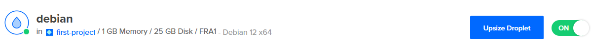

# h4 Maailma kuulee

> ## Ympäristö
> ### Rauta: 
> - Käyttöjärjelmä: Windows 11 Education x86-64 23H2
> - Prosessori: AMD Ryzen 3900XT 3.9GHz 12-core
> - RAM: 32GB
> - Näytönohjain: Nvidia Geforce 3080 RTX
> - Kiintolevy: Samsung 2 TB M.2 SSD
> ### Virtuaali:
> - Virtualisointi: VirtuaBox 7.0.20
> - Käyttöjärjestelmä: Debian 12 x86-64
> - CPU: 4 core
> - RAM: 8GB
> - Kiintolevy: 200 GB

## x) Lue ja tiivistä. Tiivistelmäksi riittää muutama ranskalainen viiva per artikkeli. (Tässä alakohdassa ei tarvitse tehdä testejä tietokoneella)

### [Susanna Lehto. 2022. Teoriasta käytäntöön pilvipalvelimen avulla (h4)](https://susannalehto.fi/2022/teoriasta-kaytantoon-pilvipalvelimen-avulla-h4/)
Raportissaan Lehto kuvaa askel askeleelta vaiheet pilvipalvelimen vuokraukseen, asentamiseen ja alkukonfigurointiin. Tässä askeleet on tiivistetty yleisen tason pikaohjeeksi ja Lehdon valinnat on merkattu sulkuihin.

a) Pilvipalvelimen vuokraus ja asennus
- Valitse palveluntarjoaja ja rekisteröidy (DigitalOcean).
- Valitse maksutapa ja aktivoi haluamasi laskutushälytykset (Github Education krediittitarjous).
- Valitse uusi virtuaalikone ja määritä sijainti, speksit ja käyttöjärjestelmä (Amsterdam, $5/kk kone Intelin prosessorilla ja normaalilla SSD levyllä).
- Valitse autentikaatiomenetelmäksi SSH tai salasana (Salasana, koska SSH ei vielä ollut tuttu).
- Valitse haluamasi lisäominaisuudet (Ei mitään).
- Määritä koneen hostname (debian).
- Katso koneen IP-osoite.

Lehto kuvaa vielä domain nimen vuokrausprosessin, mutta koska se on nykyisessä toteutuksessa seuraavan viikon aihetta, jätin sen tiivistelmän ulkopuolelle.

d) Palvelin suojaan palomuurilla
- Ota palvelimeen SSH etäyhteys juurikäyttäjänä ja syötä palvelimelle määrittelemäsi salasana(`$ ssh root@188.166.4.6`).
gd) Palvelin suojaan palomuurilla
- Hae päivitykset (`$ sudo apt-get update`).
- Asenna palomuuri (`$ sudo apt-get install ufw`).
- Avaa haluamasi portit (`$ sudo ufw allow 22/tcp`).
- Laita palomuuri päälle (`$ sudo ufw enable`).

e) Kotisivut palvelimelle
- Lisää käyttäjä ja määritä salasana(`$ sudo adduser suska`).
- Tee käyttäjästä pääkäyttäjä (`$ sudo adduser suska sudo`).
- Testaa toimivatko käyttäjän tunnukset (`$ ssh suska@188.166.4.6`).
- Lukitse juuri (`$ sudo usermod –lock root`).
- Kirjaudu pääkäyttäjänä ja asenna puuttuvat päivitykset (`$ sudo apt-get updage` -> `$ sudo apt-get upgrade` -> `$ sudo apt-get dist-upgrade`).
- Asenna webbipalvelin ja tarkista sen tila (`$ sudo apt-get install apache2` -> `$ sudo systemctl status apache2`).
- Avaa portti (`$ sudo ufw allow 80/tcp`).
- Ota yhteys ja tarkista sivun näkyvyys.
- Korvaa Apachen oletussivu (`$ echo Hello world! |sudo tee /var/www/html/index.html`).
- Ota userdir moduuli käyttöön, jos haluat käyttäjäkohtaiset kotisivut ja uudelleenkäynnistä palvelin (`$ sudo a2enmod userdir` -> `$ sudo service apache2 restart`).
- Tee kotisivut ja tarkista toimivuus osoitteessa palvelin/~käyttäjä/ (`susannalehto.me/~suska/`).

f) Palvelimen ohjelmien päivitys
- Ota SSH yhteys palvelimeen ja aja päivitykset (`$ sudo apt-get update` -> `$ sudo apt-get upgrade` -> `$ sudo apt-get dist-upgrade`).

### Tero Karvinen. 2017. [First Steps on a New Virtual Private Server – an Example on DigitalOcean and Ubuntu 16.04 LTS](https://terokarvinen.com/2017/first-steps-on-a-new-virtual-private-server-an-example-on-digitalocean/)
Artikkeli on pikaohje uuden pilvipalvelimen vuokraukseen ja asentamiseen. Ohjeessa käytetyt palveluntarjoajat DigitalOcean ja NameCheap on valittu, koska ne tarjoavat ilmaisia krediittejä opiskelijoille GitHub Educationin kautta.

- Tee uusi virtuaalinen palvelin DigitalOceaniin ja ota siihen yhteys juurikäyttäjänä ensimmäistä ja viimeistä kertaa (`$ ssh root@10.0.0.1`).
- Anna hyvä salasana.
- Käynnistä palomuuri (`$ sudo ufw allow 22/tcp` -> `$ sudo ufw enable`).
- Tee uusi käyttäjä ja tee tästä pääkäyttäjä (`$ sudo adduser tero` -> `$ sudo adduser tero sudo` -> `$ sudo adduser tero adm` -> `$ sudo adduser tero admin`).
- Testaa uutta käyttäjää avaamalla uusi ssh yhteys (`$ ssh tero@tero.example.com`).
- Sulje juurikäyttäjä (`$ sudo usermod --lock root`).
- Estä juurena kirjautuminen SSH:ssa (`$ sudoedit /etc/ssh/sshd_config` -> `PermitRootLogin no` -> `$ sudo service ssh restart`).
- Hae päivitykset (`$ sudo apt-get update` -> `$ sudo apt-get upgrade`).
- Vuokraa nimi esimerkiksi NameCheapistä.

### a) Vuokraa oma virtuaalipalvelin haluamaltasi palveluntarjoajalta. (Vaihtoehtona voit käyttää ilmaista kokeilujaksoa, GitHub Education krediittejä; tai jos mikään muu ei onnistu, voit kokeilla ilmaiseksi vagrant:ia paikallisesti. Suosittelen kuitenkin harjoittelemaan oikeilla, tuotantoon kelpaavilla julkisilla palveluilla).

Käytin [DigitalOceania](https://www.digitalocean.com/) pilvipalveluntarjoajana, koska heillä oli tarjous ilmaiskrediiteistä GitHub Educationin kautta. Rekisteröinnin yhteydessä annoin louttokorttitiedot henkilöllisyyteni varmentamiseksi, jonka jälkeen hain ilmaiskrediitit linkkaamalla GitHub tilini käyttäen [GitHub Educationistä](https://github.com/education) hakemaani yhteistyökumppani linkkiä. Laitoin vielä DigitalOceaniin 2FA autentikaation päälle käyttäen Google Authenticator Android appiä.

Varmistettuani krediittien saapuneen lähdin luomaan uutta pilvipalvelinta.

Valitsin sijanniksi Frankfurtin ja koneeseen kevyimmät tarjotut speksit. En valinnut mitään tarjotuista lisäominaisuuksista ja autentikaatiometodiksi valitsin salasanan.

Käynnistin sen ja huomasin unohtaneeni nimeksi oletusarvon. Prosessissa meni noin minuutti, jonka jälkeen se näkyi aktiivisena DigitalOceanissa.

### b) Tee alkutoimet omalla virtuaalipalvelimellasi: tulimuuri päälle, root-tunnus kiinni, ohjelmien päivitys.

Kirjauduin sisään juurikäyttäjänä ja asensin päivitykset sekä palomuurin.

- `$ ssh root@104.248.140.126`
- `$ sudo apt-get update`
- `$ sudo apt-get upgrade`
- `$ sudo apt-get install ufw`
- `$ sudo ufw allow 22/tcp`

Tämän jälkeen loin uuden käyttäjän ja laitoin tämän sudo ryhmään.

- `$ sudo adduser janne`
- `$ sudo adduser janne sudo`

Sitten avasin uuden terminaalin ja kokeilin kirjautumista jannella.

Kirjautumisen onnistuttua estin juurikäyttäjänä kirjautumisen ja kirjauduin ulos juurikäyttäjältä.

- `$ sudoedit /etc/ssh/sshd_config` 
- `PermitRootLogin no`
- `$ sudo service ssh restart`

Varmistin vielä, ettei juurikäyttäjänä kirjautuminen onnistu.

Tämän jälkeen nimesin vielä hostin uudestaan ja ajoin viimeisen päivityskomennon.
- `sudo hostnamectl set-hostname DebOfNight`
- `sudo apt-get dist-upgrade`

Otin yhteyden uudestaan varmistaakseni host nimen muuttuneen.

### c) Asenna weppipalvelin omalle virtuaalipalvelimellesi. Korvaa testisivu. Kokeile, että se näkyy julkisesti. Kokeile myös eri koneelta, esim kännykältä.

Asensin Apachen, avasin http pyyntöjen oletusportin ja kokeilin sivun näkyvyyden pöytäkoneeltani webbiselaimessa.

- `sudo apt-get intall apache2`
- `sudo ufw allow 80/tcp`

Korvasin oletussivun tekstillä "hi" ja kokeilin sivun toimivan pöytäkoneen selaimella.

- `echo hi | sudo tee /var/www/html/index.html`

Halusin vielä editoida oikean (hyvin pienen) webbisivun, joten asensin micron helpompaan editointiin komennolla `sudo apt-get install micro` ja kirjoitin pienin webbisivun. Varmistin myös sivun näkyvän kännykällä.

*Kuvattu ssh yhteydellä hallitulla palvelimella sivu micro editorissa, curl komento paikallisella virtuaalikoneella ja webbisivu avattuna pöytäkoneen selaimessa.*

Kokeilin vielä uuden virtualhostin tekemistä käyttäjän kotihakemistoon, mutta siihen yhdistäessä tuli 403 forbidden virheilmoitusta, ja koska se ei kuulunut tämän viikon tehtävänantoon poistin sen vain käytöstä, enkä lähtenyt selvittämään syitä.

## Lähteet
Karvinen, T. 2024. H4 Maailma Kuulee. https://terokarvinen.com/linux-palvelimet/#h4-maailma-kuulee

Karvinen, T. 2017. First Steps on a New Virtual Private Server – an Example on DigitalOcean and Ubuntu 16.04 LTS. https://terokarvinen.com/2017/first-steps-on-a-new-virtual-private-server-an-example-on-digitalocean/

Lehto, S. 2022. Teoriasta käytäntöön pilvipalvelimen avulla (h4). https://susannalehto.fi/2022/teoriasta-kaytantoon-pilvipalvelimen-avulla-h4/

Digital Ocean. https://www.digitalocean.com/

Github Education. https://github.com/education
## Lisenssi
Sivun sisältöä saa levittää GPL-3.0 lisenssin sallimin ehdoin: https://github.com/jaolim/linux-servers?tab=GPL-3.0-1-ov-file#readme
