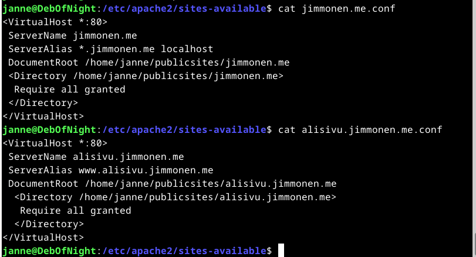

# h5 Nimekäs

> ## Ympäristö
> ### Rauta: 
> - Käyttöjärjestelmä: Windows 11 Education x86-64 23H2
> - Prosessori: AMD Ryzen 3900XT 3.9GHz 12-core
> - RAM: 32GB
> - Näytönohjain: Nvidia Geforce 3080 RTX
> - Kiintolevy: Samsung 2 TB M.2 SSD
> ### Virtual Box:
> - Virtualisointi: VirtuaBox 7.0.20
> - Käyttöjärjestelmä: Debian 12 x86-64
> - CPU: 4 core
> - RAM: 8GB
> - Kiintolevy: 200 GB
> ### Pilvi
> - Pilvipalvelinpalveluntarjoaja: Digital Ocean
> - Domain Name Registrar: Namecheap
> - Sijainti: Frankfurt, Saksa
> - IP tyyppi: ipv4
> - RAM: 1 GB
> - Kiintolevy: 25 GB SSD

### c) Pubkey. Automatisoi kirjautuminen julkisella SSH-avaimella.
Ajankäyttö: ~30 minuuttia tehtävään, ~15 minuuttia avaimen varmuuskopion pakkaukseen ja kopiointiin ulos virtuaalikoneelta.

Välttyäkseni turhalta salasanan näpyttelyltä päädyin aloittamaan viikon tehtävät kohdasta c.
Vaikka avaimen luominen ja kopiointi käytiin tunnilla läpi, kaivoin muistin tueksi [ssh.comin ohjeet avaimen luonnista ja kopioinnista](https://www.ssh.com/academy/ssh/copy-id). 
Ohjeita noudattaen tein seuraavat askeleelt.
- `$ ssh-keygen` avaimen luomiseksi. Jätin nimen oletusarvoksi ja passphrasen tyhjäksi.

- `$ ssh-copy-id -i ~/.ssh./id_rsa janne@jimmonen.me` avaimen kopioimiseksi lokaalilta virtuaalikoneelta palvelimelle. Tämä vielä vaati salasanan syöttämisen.
- `$ ssh -i ~/.ssh/id_rsa janne@jimmonen.me` testatakseni kirjautumisen ssh avaimella. Kirjautuminen onnistui ilman salasanaa.

Lähdin vielä poistamaan salasanakirjautumisen, mutta ajettuani `$ sudoedit /etc/ssh/sshd_config` huomasin kohdan `PasswordAuthentication no` olevan jo päällä.
Testasin vielä ettei salasanakirjautuminen onnistu Windows koneeni command promptilla.

Halusin vielä varmuuskopion avaimista Windows koneelleni, joten päätin asentaa 7-zipin ja pakata .shh kansion salattuun .7z tiedostoon. Päädyin 7-zippiin koska se oli minulle jo entuudestaan tuttu ohjelma.
- `$ apt-cache search 7-zip` etsin ohjelman nimen.
- `$ sudo apt-get install p7zip-full` asensin ohjelman.
- `$ 7z a -p mhe=on deb.7z .ssh` komento tehdä pakkaus piilotetulla kansiorakenteella ja erillisellä salasana promptilla.

En saanut jaettua clipboardia toimimaan tiedoston siirrossa, joten määrittelin vielä VirtualBoxilla jaetun kansion.

Tämän jälkeen kopioin pakatun tiedoston jaettuun kansioon.
- `$ sudo adduser janne vboxsf` lisäsin käyttäjän virtualboxin jaettujen kansioiden käyttäjäryhmään.
- `$ sudo mount -t vboxsf shared_debianJI /mnt` mounttasin jaetun kansion polkuun `/mnt`.
- `$ cp /home/janne/deb.7z /mnt/deb.7z` tein kopion salaten pakatusta avainkansiosta jaettuun kansioon, josta varmistin sen näkyvyyden Windowsissa.

### a) Kotisivu. Tee vähintään kolmen erillisen weppisivun kotisivu ja kopioi se näkymään palvelimellesi. Jos sinulla on oikea palvelin Internetissä, kannattaa käyttää sitä. Käytä name based virtual hosting tekniikkaa. Sivujen muokkaamisen pitää onnistua ilman pääkäyttäjän oikeuksia, niiden kopioiminen pääkäyttäjänä testisivun paikalle ei käy. Kotisivujen ei tarvitse olla hienoja, mutta niiden tulee olla validia HTML:ää ja linkittää toisiinsa.
Ajankäyttö: 1 tunti 40 minuuttia. 

Olin jo edellisellä viikolla ajatellut toteuttaa käyttäjille kotisivut, mutta tällöin sivu tuotti `403 forbidden` virheilmoitusta, joten päädyin silloin käyttämään toimivassa oletushakemistossa olevaa sivua.
Tämä kuitenkin jäi ärsyttämään itseäni ja koska h3-tehtävässä virtual hostin näkyvyydet olivat toimineet ilman lisäsäätöä, lähdin selvittämään ongelmaa vertailemalla sivujen kohdepolun käyttäjäoikeuksia lokaalin virtuaalikoneen ja pilvikoneen välillä.
Itse sivujen hakemistossa ja index.html tiedostossa oikeudet olivat identtiset, mutta matkalta sinne /home/ ja /janne/ hakemistoissa ei omistajakäyttäjäryhmälle tai muille käyttäjille oltu annettu luku eikä execute oikeuksia.
Korjasin tämän antamalla kyseisiin kansioihin omistajaryhmälle ja muille käyttäjille luku ja execute oikeudet (`chmod 755`) ja tarkistin forbidden virheen kadonneen.

Lyhyesti chmodista: chmod määrittää käyttäjäoikeudet käyttäen kolmen numeron sarjaa, joista jokainen on väliltä 0-7. Jokainen näistä määrittää tietyn käyttäjän käyttäjäoikeudet kohteeseen ja binäärimuodossa esitettynä numerosta näkee suoraan oikeudet järjestyksessä read(r) - write(w) - execute(x).
- 0 - 000 - ---
- 1 - 001 - --x
- 2 - 010 - -w-
- 3 - 011 - -wx
- 4 - 100 - r--
- 5 - 101 - r-x
- 6 - 110 - rw-
- 7 - 111 - rwx

Käyttäjät määritellään järjestyksessä omistaja - omistajaryhmä - muut, joten `chmod 750` antaisi omistajalle kaikki oikeudet (7 -> 111 -> rwx), omistajaryhmälle luku ja execute oikeudet (5 -> 101 -> r-x), ja muille ei mitään oikeuksia (0 -> 000 -> ---).

Tämä oli lähtötilanne tähän tehtävään.

http://jimmonen.me/~janne/

Koska minulla oli jo käyttäjien kotisivut aktivoituina (`sudo a2enmod userdir`) päätin käyttää siitä ensimmäiseen sivustoon. Varmistin ensin yhteydenoton onnistuvan.

Minulla oli GitHub pagesissa jo digipalveluiden johdantokurssia varten tehdyt sivut, joten päädyin käyttämään niiden sisältöä tälle sivulle. Minulla oli git jo asennettuna, muutoin `sudo apt-get git` olisi ajettava ensiksi.

Tarkistin sivuston toimivuuden.

Lopuksi vielä muokkasin etusivun Home linkin ohjaamaan `http://jimmonen.me` saavuttaakseni ohjeiden mukaiseen toisiinsa linkkauksen.

http://jimmonen.me

Koska olin jo tehnyt kaksi virtualhostia aikaisemmassa tehtävässä, päätin aluksi kopioida nämä pilvipalvelimelle ja sen jälkeen muokata sivustoihin uudelleenohjauksen.

Kokeilin samaa virtual hostin tiedostoille, mutta en saanut kopiointia `/etc/apache2/sites-available` suoraan onnistumaan, joten kopioin ne ensin väliaikaiseen suojaamattomaan kansioon `/home/janne/sitestemp/`.

Editoin hostit vastaamaan oikeita osoitteita ja korjasin sisällön polkurakenteen.

Käynnistin hostit ja uudelleenkäynnistin apachen.
- `$ sudo a2ensite jimmonen.me.conf`
- `$ sudo a2ensite alisivu.jimmonen.me.conf`
- `$ sudo systemctl reload apach2`
Varmistin etusivun toimivuuden ja aloin lisäämään linkit toisille sivuille.
Tässä kohtaan totesin, ettei toiseen virtual hostiin linkkaaminen ole mielekästä ja kirjoitin vielä kolmannen sivun jimmonen.me kansioon.
Varmistin sivujen toimivuuden ja validoin ne käyttäen [W3C:n html validoijaa](https://validator.w3.org/)

### b) Alidomain. Tee kaksi uutta alidomainia, jotka osoittava omaan koneeseesi. Esimerkiksi palvelu on example.com -> linuxkurssi.example.com. Tee toinen alidomain A-tietueella ja toinen CNAME-tietueella. Alidomainit ovat tyypillisesti ilmaisia, kun sinulla on päädomain (example.com).
Ajankäyttö: 55 minuuttia.

Lähdin tutkimaan NameCheapin Advanced DNS valikkoa palvelimelle, ja lisäsin sinne sivun suoraan haluamallani host nimellä.

En halunnut vanhentuneita tietoja jumiin lähimmän DNS:n välimuistiin, joten kokeilin toimivuutta käyttäen host komentoa ja NameCheapin omaa DNS palvelinta `$ host alisivu.jimmonen.me dns1.registrar-servers.com`.
Sivua ei kuitenkaan näyttänyt olevan, joten luettuani [Name Cheapin ohjeita alidoimain tekemisestä](https://www.namecheap.com/support/knowledgebase/article.aspx/9776/2237/how-to-create-a-subdomain-for-my-domain/) tajusin luoneeni alidomainin osoitteeseen `alisivu.jimmonen.me.jimmonen.me` ja tarkistin tämän vastaavan.

Kävin muokkaamassa Alisivun Hostin muotoon `alisivu` ja tämän jälkeen `$ host alisivu.jimmonen.me dns1.registrar-servers.com` tuotti onnistuneen vastauksen.
En vielä kuitenkaan lähtenyt selaimella kokeilemaan, koska tässä kohtaan vastaan tulevat virheet olisivat ainoastaan kiinni vanhentuneista tiedoista alavirran DNS palvelimilla ja selaimella kokeilu on mielekästä vasta palvelimen virtualhosteja kokeillessa (pitäisi toimia jo nyt, koska NameCheapin palvelimilla osoite on päivitetty ja on epätodennäköistä, että alavirrassa nimipalvelimella olisi voimassaoleva väärä tieto, joten kyselyn pitäisi aiheuttaa jatkokysely ylävirtaan, jonka tuloksena pitäisi olla vastaus oikealla osoitteella, mutta tässä kohtaan testaus on turhaa.).

Jatkoin Name Cheapin ohjeen lukemista tulkitsin A:n ja CNAMEn eron olevan, että A ohjaa aina IP-osoitteeseen ja CNAMEn voi laittaa ohjaamaan domain nimeen.
Tein CNAME Recordin ohjaamaan kaikki jimmonen.me loppuiset kyselyt jimmonen.me osoitteeseen.

Varmistin toimimisen mielivaltaisella jimmonen.me loppuisella osoitteella.

Nyt testasin vihdoin alisivun ja wildcardin toimimista selaimella. Alisivu ohjasi sille määriteltyyn virtualhostiin alisivu.jimmonen.me ja wildcard apachen oletussivulle, jonka sisällön olin viime viikon tehtävässä muuttanut.

Koska halusin sivun ohjaamaan pääsivulle poistin oletushostin komennolla `$ sudo a2dissite 000-default.conf` ja `$ sudo systemctl reload apache2`.
Tämän jälkeen wildcard sivut ohjasivat alisvu.jimmonen.me. Halusin ne pääsivulle, joten kävin vielä muokkaamassa pääsivun hostia nappaamaan wildcard sivut ServerAliaksen kautta.
 

Varmistin vielä ohjauksen toimivan selaimessa.

 
### d) Tutki jonkin nimen DNS-tietoja 'host' ja 'dig' -komennoilla. Käytä kumpaakin komentoa kaikkiin nimiin ja vertaa tuloksia. Katso man-sivulta, miten komennot toimivat - esimerkiksi miten 'dig' näyttää kaikki kentät. Analysoi tulokset. Etsi tarvittaessa uusia lähteitä haastaviin kohtiin. Sähköpostin todentamiseen liittyvät SPF ja DMARC -tietojen yksityiskohdat on jätetty vapaaehtoiseksi lisätehtäväksi.
###	Tutkittavat nimet:
### - Oma domain-nimesi. Vertaa tuloksia nimen vuokraajan (namecheap.com, name.com...) weppiliittymässä näkyviin asetuksiin.
### - Jonkin pikkuyrityksen, kerhon tai yksittäisen henkilön weppisivut. (Ei kuitenkaan kurssikaverin tällä viikolla vuokrattua nimeä).
### - Jonkin suuren ja kaikkien tunteman palvelun tiedot.
Ajankäyttö: ~1 tunti 30 minuuttia.

Aloitin tehtävän katsomalla [Tony Teaches Tech youtube videon](https://www.youtube.com/watch?v=iESSCDnC74k) Digin peruskomennoista ja niiden lukemisesta.

Asensin digin (ja joitain muita työkaluja) videossa esitetyllä komennolla `$ sudo apt-get install dnsutils` ja katsoin sekä Digin, että hostin tldr sivut (pikamanuaaliohjelma).

### jimmonen.me, alisivu.jimmonen.me, wildcard.jimmonen.me
Lähdin sen jälkeen tutkimaan omia sivujani ajamalla parametrittömät host ja dig kyselyt osoitteille jimmonen.me, alisivu.jimmonen.me ja wildcard.jimmonen.me.

Tulokset olivat Namecheapin asetusten mukaisia; jimmonen.me ja alisivu.jimmonen.me viittasivat samaan IP-osoitteeseen ja wildcard oli alias jimmonen.me sivulle.

Hyödyntäen [uptimia.comin artikkelila kenttien tulkitsesta apuna](https://www.uptimia.com/questions/what-do-the-five-fields-in-a-dig-querys-answer-section-mean) tulkitsin tulostetta tarkemmin. Digin tulosteessa `ANSWER SECTION:` viittaa vastaukseen.

`jimmonen.me.	11	IN	A	104.248.140.126` aukikirjoitettuna:

- `jimmonen.me.` - Domain nimi
- `11` - TTL(Time To Live), 11 sekuntia jäljellä(300 jos kyselyhetkellä se on vanhentunut)
- `IN` -  Internet
- `A` A Record
- `104.248.140.126` - IP-osoite.

### poe.re
Path of Exile peli tukee regular expressionia hauissa eri UI elementeissä ja poe.re on kolmannen osapuolen ylläpitämä työkalu hakutermien generointiin. Sivujen statistiikan mukaan siellä oli viimeisen kuukauden aikana ~700k uniikkia vierailijaa.

Peruskyselyllä sain selville poe.re:n IP-osoitteet.

Käänteisellä kyselyllä selvisi sivuston palvelimen olevan GitHubissa.

### netflix.com
Ajoin samat askeleet netflixille ja huomasin osoitteiden ohjaavan Länsi-Euroopan Amazonin pilvipalvelimiin.

Host ja dig kyselyt antoivat eri IP:eitä, joten lähdin selvittämään määrittelemällä kyselyn Googlen nimipalvelimeen 8.8.8.8.

Näissäkin oli eroja, ja kaikki osoitteet erosivat oletusnimipalvelimen antamista osoitteista, joten lähdin hakemaan laajemmalla komennolla kaikki kentät Googlen nimipalvelimelta `$ dig @8.8.8.8 netflix.com ANY`

Tästäkään ei löytynyt vastausta siihen, miksi host ja dig tuottivat eri IP:t, mutta yleisesti nopeasti vaihtuvien IP-osoitteiden taustalla 60 sekuntiin määritelty TTL.

A recordin lisäksi kysely tuotti mm. NS (Name Server), MX (Mail Exchange), AAAA(IPv6 A record) kenttiä.

## Lähteet
Karvinen, T. 2024. H5 Nimekäs. https://terokarvinen.com/linux-palvelimet/#h5-nimekas

Namecheap. How to Create a Subdomain for my Domain. https://www.namecheap.com/support/knowledgebase/article.aspx/9776/2237/how-to-create-a-subdomain-for-my-domain/

Tony Teaches Tech. 2021. How To Lookup DNS Records With The dig Command. https://www.youtube.com/watch?v=iESSCDnC74k

Uptimia.com. What Do The Five Fields In A Dig Query's Answer Section Mean?. 2024. https://www.uptimia.com/questions/what-do-the-five-fields-in-a-dig-querys-answer-section-mean

W3C. Html validator. https://validator.w3.org/

## Lisenssi
Sivun sisältöä saa levittää GPL-3.0 lisenssin sallimin ehdoin: https://github.com/jaolim/linux-servers?tab=GPL-3.0-1-ov-file#readme
