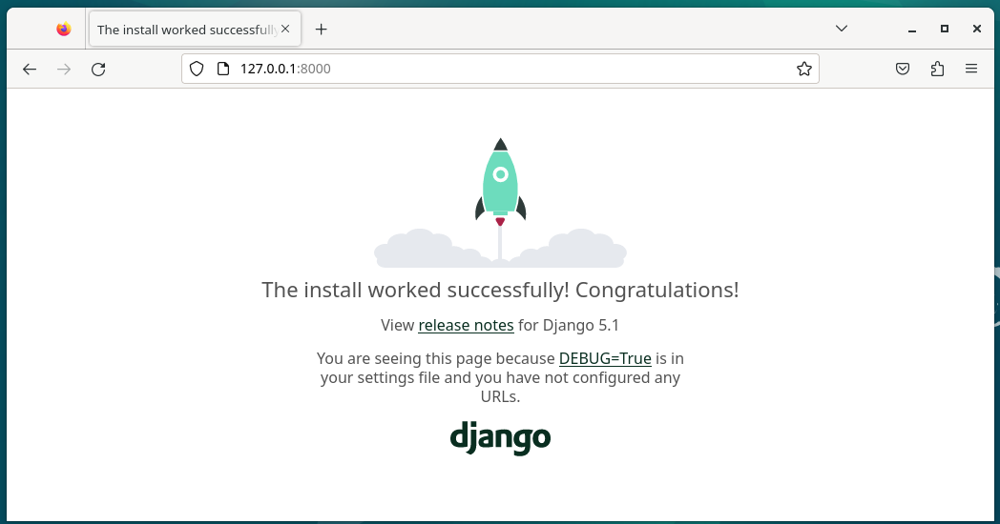
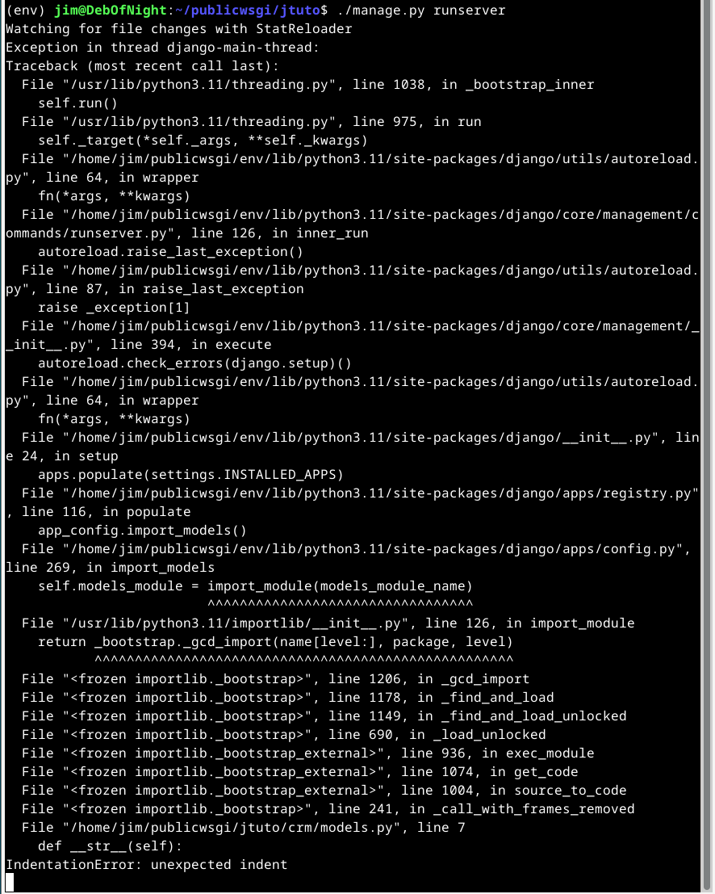

### h6 Hello Django

> ## Ympäristö
> ### Rauta: 
> - Käyttöjärjestelmä: Windows 11 Education x86-64 23H2
> - Prosessori: AMD Ryzen 3900XT 3.9GHz 12-core
> - RAM: 32GB
> - Näytönohjain: Nvidia Geforce 3080 RTX
> - Kiintolevy: Samsung 2 TB M.2 SSD
> ### Virtual Box:
> - Virtualisointi: VirtuaBox 7.0.20
> - Käyttöjärjestelmä: Debian 12 x86-64
> - CPU: 4 core
> - RAM: 8GB
> - Kiintolevy: 200 GB
> ### Pilvi
> - Pilvipalvelinpalveluntarjoaja: Digital Ocean
> - Domain Name Registrar: Namecheap
> - Sijainti: Frankfurt, Saksa
> - IP tyyppi: ipv4
> - RAM: 1 GB
> - Kiintolevy: 25 GB SSD

### a) Tee yksinkertainen esimerkkiohjelma Djangolla.

Ajankäyttö: 1t, 20min.

Lähdin asentamaan Djangoa paikalliselle virtuaalikoneelleni [Karvisen ohjeita seuraten](https://terokarvinen.com/2022/django-instant-crm-tutorial/).

Asensin virtuaaliympäristön.

Aloitin Django projektin.

Testasin toiminnan selaimessa

Ajoin migraation.

Asensin salasanageneraattorin ja generoin salasanan.
`$ sudo apt-get install pwgen`
`$ pwgen -s 20 1`

Lisäsin pääkäyttäjän käyttäen generoitua salasanaa ja kokeilin kirjautumista.
`$ ./manage.py createsuperuser`

Webbikäyttöliittymässä tein uuden käyttäjän ja lisäsin tälle henkilökunta- ja pääkäyttäjäoikeudet.

Tein asiakastietokannan ajamalla `$ ./manage.py startapp crm` ja lisäsin sen INSTALLED_APPS kohtaan settings.py tiedostossa.

Lisäsin Customer luokan tietokantaan muokkaamalla crm/models.py tiedostoa.

Rekisteröin asiakkaat Admin näkymään muokkaamalla crm/admin.py tiedostoa ja varmistin tämän näkyvän webbikäyttöliittymässä.

Lisäsin webbikäyttöliittymässä uuden asiakkaan ja määrittelin asiakkaan nimen mielekkääksi muokkaamalla crm/models.py tiedostoa.

### b) Tee Djangon tuotantotyyppinen asennus
Ajankäyttö: 5t, 8min.

Seurasin tässäkin tehtävässä [Karvisen ohjetta](https://terokarvinen.com/2022/deploy-django/).
Päätin tehdä toteutuksen pilvikoneelle.

Aloitin ottamalla yhteyden pilvikoneeseen `$ ssh janne@jimmonen.me` ja tekemällä uuden VirtualHostin Apacheen.

*Päivitys 01.10.2024 16:40: jimmonen.me ja alisivu.jimmonen.me linkit korjattu*

Tämän jälkeen aktivoin sivun ja kokeilin `$ curl localhost` ja huomasin väärän sivun vastaavan (olisi pitänyt olla [http://jimmonen.me](http://jimmonen.me), mutta [http://alisivu.jimmonen.me](http://alisivu.jimmonen.me) vastasi).

Huomasin ettei localhost toimi aliaksena VirtualHostin asetuksissa, joten käytin puolisen tuntia ongelman ratkaisemiseen eri google hauilla ja tiedostojen editoimalla.

Päädyin siihen, että localhost sivu määrittyy VirtualHostien järjestyksen mukaan, ja koska ne on määritelty eri tiedostoissa, muutin jtuto.conf nimen 0jtuto.confiksi, jonka jälkeen `$ curl localhost/static/` tuotti halutun vastauksen.
Toinen todennäköisesti toimiva vaihtoehto olisi ollut uudelleenohjata localhost hosts tiedostoa muokkaamalla.

Asensin virtuaaliympäristön ja Djangon edellisen tehtävän tavoin.

- `$ sudo apt-get -y install virtualenv`
- `$ cd`
- `$ cd publicwsgi/`
- `$ virtualenv -p python3 --system-site-packages env`
- `$ source env/bin/activate`
- `$ which pip /home/janne/publicwsgi/env/bin/pip`
- `$ micro requirements.txt` -> `django`
- `$ pip install -r requirements.txt`
- `$ django-admin --version`: `5.1.1`

Koska a:n projekti on melko simppeli toistaa, päätin tehdä sen uusiksi kopioinnin sijaan.

Projektia luodessa `jtuto` kansio oli jo olemassa, joten alkuun tuhosin sen. Sen jälkeen aloitin projektin ja kokeilin curlilla develepment serverin toimivan.

Tämän jälkeen tein muut A:n askeleet.

Tein uuden käyttäjän ilman sudo oikeuksia ja kopioin publicwsgi:n sisällön tämän hakemistoon ja tein jimistä omistajan.

`$ sudo adduser jim`
`$ sudo cp -r ./publicwsgi /home/jim/publicwsgi`
`$ sudo -R chown jim:jim /home/jim/publicwsgi`

Muutin vielä aiemmin luodun virtuaalihostin polun viittaamaan tänne.

Tämän jälkeen kokeilin käynnistää dev serverin, mutta tämä päättyi virheeseen, joten päätin luoda vielä ympäristön ja projektin kertaalleen uudestaan, koska en jaksanut alkaa kaivamaan dokumentaatiosta, miten siirrot tulisi toteuttaa.
Tuhosin projektikansion ja aloitin projektin uudestaan, jonka jälkeen varmistin dev serverin käynnistävän ja `$ curl localhost:8000` vastaavan.

Lisäsin A kohdan mukaiset asetukset ja yhden pääkäyttäjän, jonka jälkeen päivitin virtualhostin asetukset ohjeen mukaisesti.

`$ curl -s localhost|grep title` vastaus oli `internal server error`. Ennen error logien katselemista päätin kokeilla, tapahtuuko sama paikallisella virtuaalikoneella.

Tehtyäni virtualhostin ja ajettuani `$ sudo apt-get -y install libapache2-mod-wsgi-py3` toimi sivusto paikallisella virtuaalikoneella.

Tämän jälkeen lähdin selvittämään ongelmaa pilvipuolella. Dev serverin käynnistys aiheutti seuraavan virheen:

Viimeinen rivi mainitsee virheen sisennyksissä, ja tässä kohtaan muistin, et sisennyksillä on merkitystä Python kielessä, eli models.py tiedosto on todennäköisin syyllinen.

Poistin sisennykset lisäsin ne tabulaattorilla uudeestaan, jonka jälkeen `./manage.py runserver` käynnisti dev serverin ongelmitta.

Otin ssh yhteyden sudo käyttäjänä aktivoin virtualhostin ja varmistin toimivuuden curlilla.

Poistin debuggauksen ja määrittelin hyväksyttävät hostit, latasin asetukset, jonka jälkeen varmistin curlilla odotetun vastauksen sivulta.

- `$ touch wsgi.py` - järjestelmä tunnistaa, että tiedostoa on muokattu ja django lataa sen uudelleen
- (sudo käyttäjänä)`$ sudo systemctl restart apache2`
- `$ curl -s localhost|grep title` - 404 haluttu vastaus

Lisäsin `import os` ja `STATIC_ROOT = os.path.join(BASE_DIR, 'static/')` rivit settings.py tiedostoon ja ajoin `$ ./manage.py collectstatic`, mutta tämä aiheutti virheen.

Varmistin että BASE_DIR oli määritelty settings.py tiedostossa ja tämän todennettuani siirsin `STATIC_ROOT = os.path.join(BASE_DIR, 'static/')` rivin viimeiseksi riviksi tiedostossa siltä varalta, että järjestyksellä on merkitystä, jonka jälkeen collect komento toimi.

Päivitin vielä `jtuto.jimmonen.me` virtualhostin ServerNameksi ja otin yhteyden pöytäkoneelta osoitteeseen [http://jtuto.jimmonen.me/admin/](http://jtuto.jimmonen.me/admin/) toiminnan varmistamiseksi. Tässä kohtaan pelkkä virtualhostin muokkaaminen riitti, koska minulla oli NameCheapissä wildcard Cname, joka ohjaa kaikki jimmonen.me loppuiset osoitteet pilvipalvelimeni IP-osoitteeseeen.

En lähtenyt kirjautumaan sivulle, koska sivu toimii vain http yhteydellä ja en halunnut turhaan lähetellä salasanoja suojaamattoman yhteyden yli.

Yhteenvetona voidaan todeta, että jo ensiaskeleillani Pythonin kanssa alan inhota tyhjien merkkien merkitystä.

## Lähteet

Karvinen, T. 2024. h6 Hello Django. https://terokarvinen.com/linux-palvelimet/#h6-hello-django

Karvinen, T. 2022. Django 4 Instant Customer Database Tutorial . https://terokarvinen.com/2022/django-instant-crm-tutorial/

karvinen, T. 2022. Deploy Django 4 - Production Install. https://terokarvinen.com/2022/deploy-django/
