# h7 Maalisuora

> ## Ympäristö
> ### Rauta: 
> - Käyttöjärjestelmä: Windows 11 Education x86-64 23H2
> - Prosessori: AMD Ryzen 3900XT 3.9GHz 12-core
> - RAM: 32GB
> - Näytönohjain: Nvidia Geforce 3080 RTX
> - Kiintolevy: Samsung 2 TB M.2 SSD
> ### Virtual Box:
> - Virtualisointi: VirtuaBox 7.0.20
> - Käyttöjärjestelmä: Debian 12 x86-64
> - CPU: 4 core
> - RAM: 8GB
> - Kiintolevy: 200 GB
> ### Pilvi
> - Pilvipalvelinpalveluntarjoaja: Digital Ocean
> - Domain Name Registrar: Namecheap
> - Sijainti: Frankfurt, Saksa
> - IP tyyppi: ipv4
> - RAM: 1 GB
> - Kiintolevy: 25 GB SSD

## a) Kirjoita ja aja "Hei maailma" kolmella kielellä.
Ajankäyttö: 46 minuuttia

### Hello C
Päätin aloittaa C:llä ja tehdä ohjelman, joka tervehtii ohjelmaa ajettaessa annettuja argumentteja, eli odotetun toiminnan tuli olla:

```
$ ./hello World
Hello World!

$ ./hello Earth and Moon
Hello Earth and Moon!
```

C:ssä argumentteja sisältävä ei vastausta palauttava main on muodossa `void main(int argc, char *argv[])`, jossa `argc` on argumenttien määrä kokonaislukuna ja `*argv[]` on argc:n pituinen taulukko pointtereita merkkijonoina annettujen argumenttien ensimmäisten alkioiden muistipaikkoihin.

C:ssä taulukot siis sijaitsevat peräkkäisillä paikoilla muistissa ja jokaisen paikan koko määräytyy taulukon tietotyypin mukaan, joka merkkijonossa (character array tai `char[]`) on yksi tavu. Taulukon lopun merkitsee `nul terminator` merkki `\0`.

Koska olin ruosteinen C:n kirjoittamisessa hain googlesta ohjeet [printf in c](https://www.geeksforgeeks.org/printf-in-c/) printf funktion syntaksin avuksi.

Päätin aluksi kirjoittaa pelkistetyn version ohjelmalogiikan varmistamiseksi käyttäen `$ gcc hello.c -o hello` kääntökomentoa, jossa `-o hello` määrittää käännetyn tiedoston nimen.

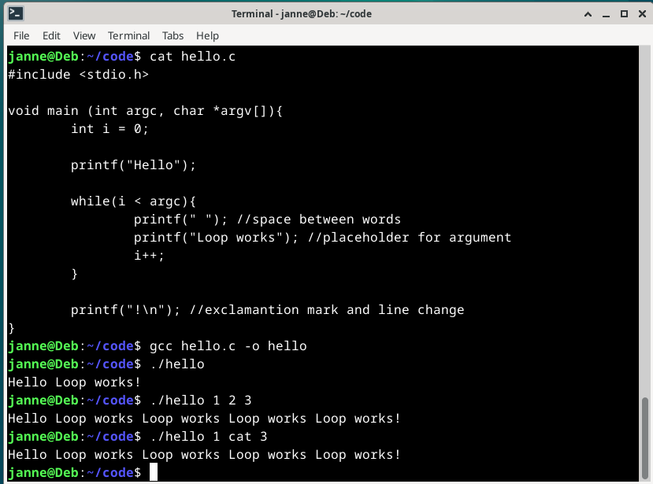

Hetken "ekstra" tulostusta ihmeteltyäni muistin, että C:ssä ohjelman nimi on ensimmäinen argumentti indeksissä 0, eli jos se halutaan ylittää pitää i alustaa arvolla 1.

Korjasin tämän ja katsoin printf ohjeesta funktiokutsun merkkijonojen tulostamiseen `printf("%s", some_string);`, jonka pistin rivin `printf("Loop works");` tilalle muodossa `printf("%s", argv[i]);`. Tämän jälkeen toiminta oli odotetun mukainen.

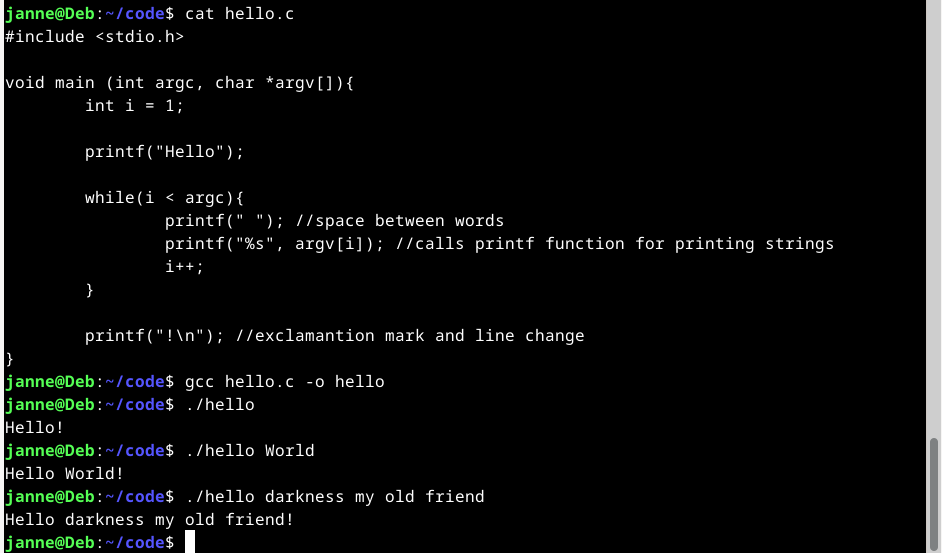

### Hello Python

Seuraavaksi tein ehkä helpoimman mahdollisen Hello, World! toteutuksen Python kielellä. Pythonin voi installoida komennolla `$ sudo apt-get python3` ja version voi tarkistaa komennolla `$ python3 --version`. Tiesin jo omaavani oikean version, joten en tehnyt näitä.

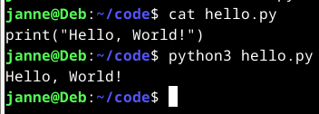

Huomionarvoista C:hen verrattuna on, ettei python ohjelmaa käännettä ennen ajamista vaan ajetaan python3 kautta.

### Hello JavaScript

Kolmanneksi Hello Worldiksi päätin tehdä .html sivun, jossa button elementti kutsuu javascript funktiota, joka näyttää ja piilottaa tekstiä "Hello World!"

Ensimmäiseen versioon laitoin vain tekstin tulostuksen napin painalluksella.

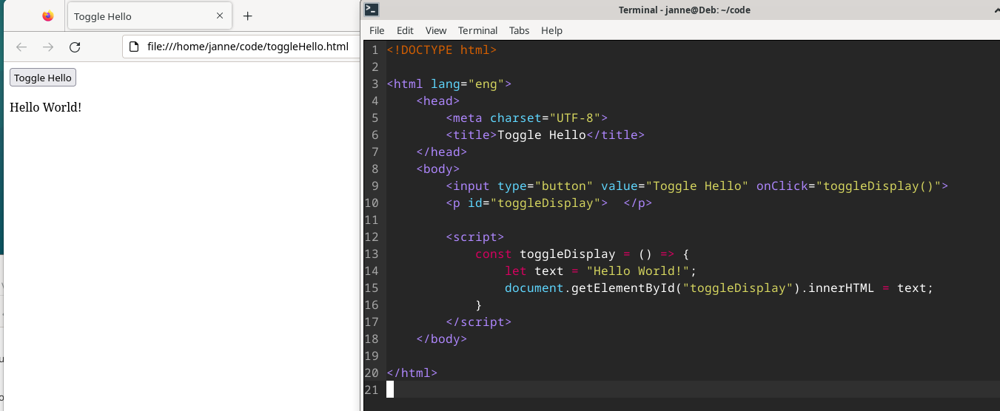

Button elementti ajaa siis painettaessa JavaScript funktion, joka kirjoittaa paragraph elementin sisällön viitaten siihen id:n avulla.

Seuraavaksi lisäsin logiikan tilan seurantaan käyttäen sivun ladatessa nollaan alustettua muuttujaa, jonka arvoa muutetaan funktiota ajaessa, ja jonka arvon perusteella tulostetaan joko "Hello World!" tai "".

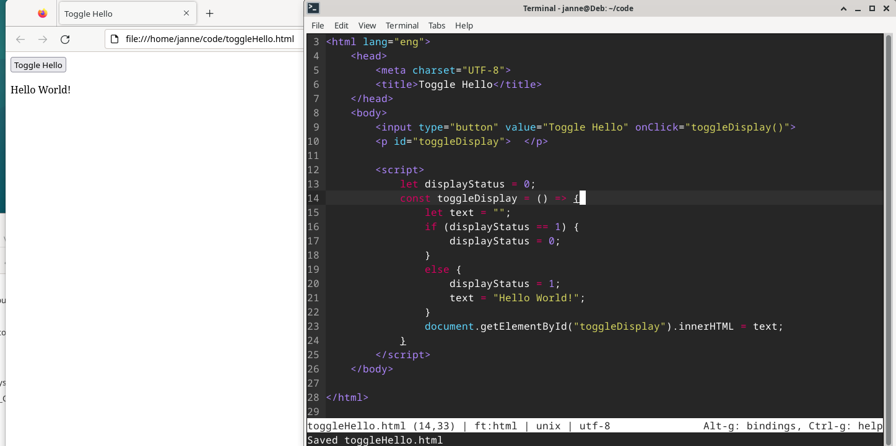

Toiminta oli odotetun kaltainen.


## b) Laita Linuxiin uusi komento niin, että kaikki käyttäjät voivat ajaa sitä.
Ajankäyttö: 55 minuuttia.

Shell script tiedostoihin, eli .sh päätteisiin tiedostoihin, voi tallentaa shell komentoja, jotka suoritetaan shellissä tiedostoa ajattaessa. Koska tiedosto on voitava suorittaa kaikilla käyttäjillä, pitää tämä muistaa huomioida tiedoston oikeuksissa.

Kaivoin skriptaamisen tueksi [geeksforgeeks.comin](https://www.geeksforgeeks.org/how-to-create-a-shell-script-in-linux/) ja [baeldung.comin](https://www.baeldung.com/linux/install-custom-bash-scripts) ohjeet aiheesta.

Päätin ensin kirjoittaa tiedoston kotihakemistossa ja siirtää sen kaikkien käytettäväksi vasta, kun toiminta oli halutan kaltainen.

Alkuun kokeilin tiedoston ajamisen hyvin yksinkertaisella scriptillä.

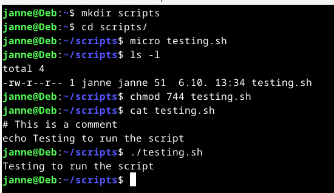

Päätin tehdä skriptin hakemaan ensimmäisenä argumenttina annettua sanaa nykyisen kansion ja kaikkien sen alikansioiden tiedostoista.

Tein kasan alikansioita ja tiedostoja toiminnan testaamiseksi.

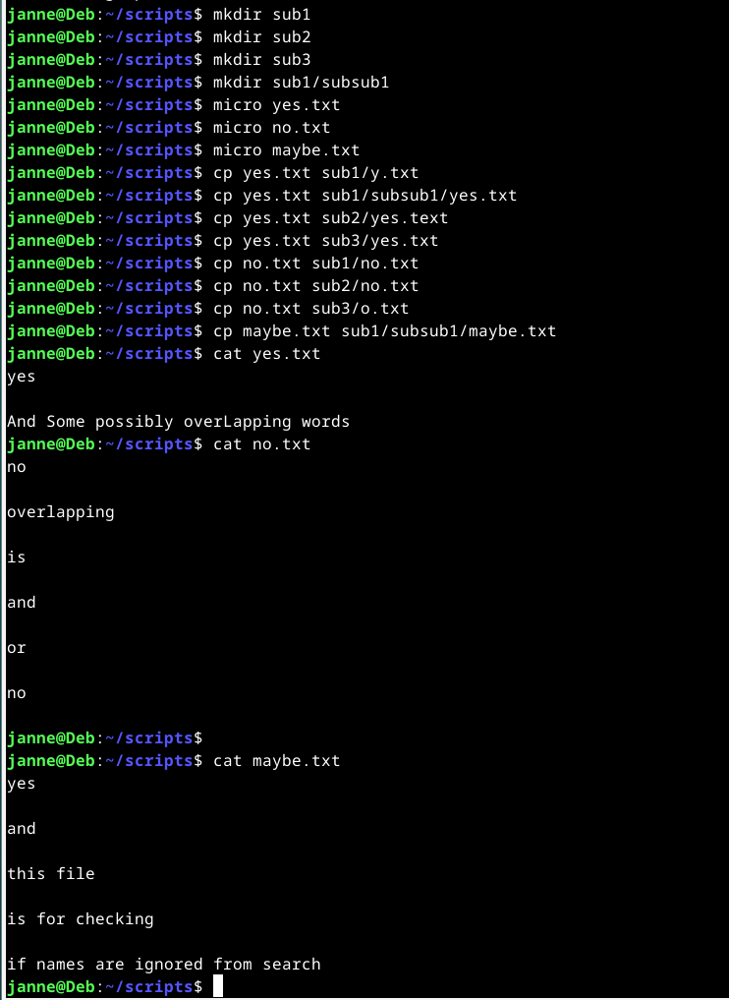

Varmistin ensin itse komennon toimivan halutun kaltaisesti.

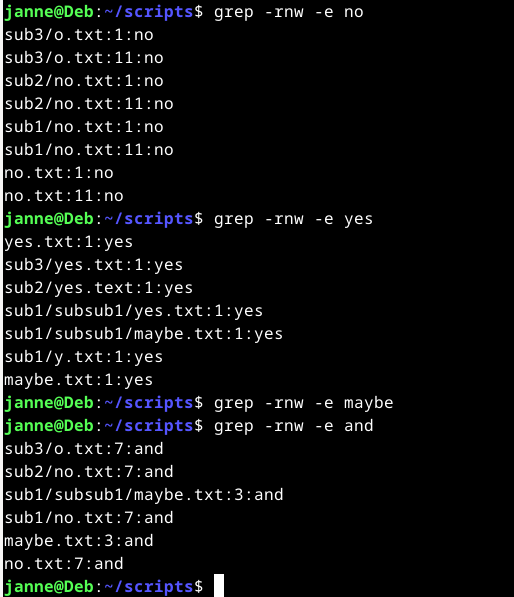

Muokkasin testin.sh:n sisällön käyttäen `$1` viittaamaan ensimmäiseen käyttäjän antamaan argumenttiin ja uudelleennimesin sen etsi.sh:ksi (etten sekoittaisi mahdollisiin valmiisiin englanninkielisiin komentoihin), jonka jälkeen testasin toiminnan.

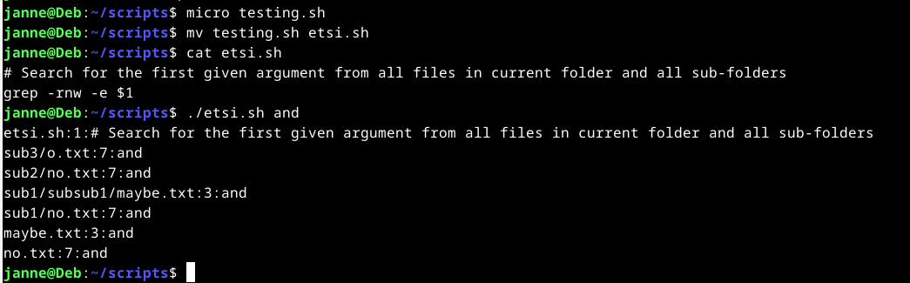

Siirsin skriptin oletushakemistoon kaikkien käyttäjien skripteille, mutta ajaessani huomasin oikeuksien puuttuvan.

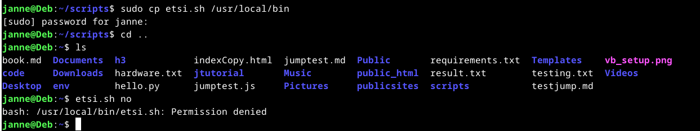

Kävin antamassa kaikille käyttäjille luku ja ajo-oikeudet (ja rootille kaikki oikeudet).

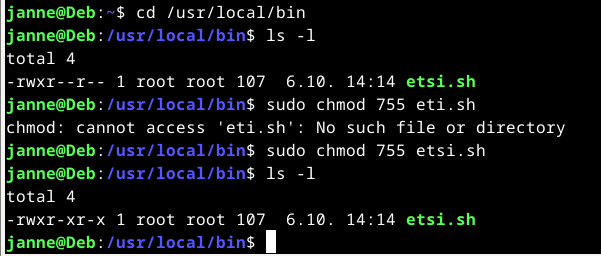

Navigoin takaisin testihakemistoon ja kokeilin hakua.

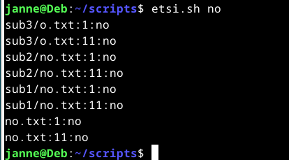

Testasin vielä toiminnan toisella käyttäjällä.

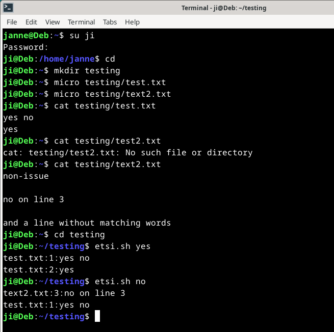

## c) Ratkaise vanha arvioitava laboratorioharjoitus soveltuvin osin.

Päädyin [kevään 2024 labraan](https://terokarvinen.com/2024/arvioitava-laboratorioharjoitus-2024-linux-palvelimet/).

Tulkitsin aikarajoituksen olevan tähän tehtävään soveltuva osa ja päätin antaa aikaa 2 tuntia 40 minuuttia tehtäviin alkaen siitä, kun saan puhtaan virtuaalikoneen ylös.

Ensiksi asensin puhtaan virtuaalikoneen ja guest additionsin.

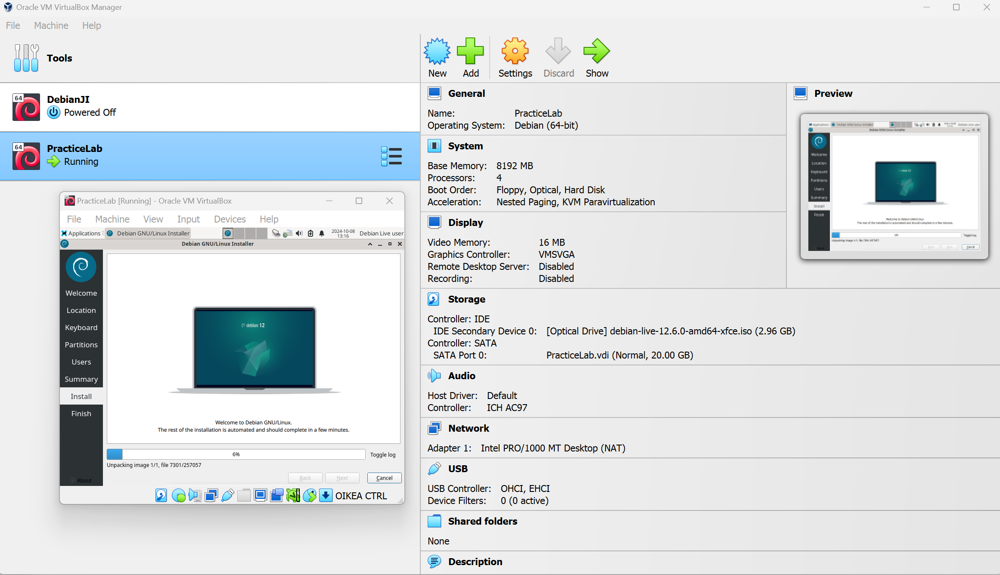

Käytin tehtävissä ohjeistettua suppeampaa raportointimenetelmää, jossa riittää testit tehtävien varmentamiseksi ja itse tehtävien vaiheet voi ylittää. Tämän määritys ja kansiorakenne raportille löytyy linkistä kohdasta Ohjeita. Koska olin jo tehnyt tätä raporttia Windowsin puolella, päätin luoda tehtävissä vaaditut tiedostot oikeisiin kansioihin, mutta tehdä itse raportin suoraan tähän Windows versioon.

Lähtötilanne oli siis uusi Debian install VirtualBoxiin, johon oli asennettu guest additions ja ajettu `$ sudo apt-get update` ja `$ sudo apt-get dist-upgrade` komennot.

### a) Taustatiedot

Hyppäsin tämän kohdan yli soveltumattomuuden vuoksi.

### b) Tiivistelmä koko työstä lopuksi
- *Vastaa tähän kohtaan aivan viimeisenä*
- *Mikä toimii, mikä ei*
	- *Tämä toimii: toimivien palveluiden osoitteet tai polut komentoihin*
	- *Tämä ei vielä toimi: luettelo kohdista, joita ei ratkaistu.*
		- *Huomaa, että nopeimpienkin viihdyttämiseksi tässä tehtävässä on enemmän kohtia kuin mitä muutamassa tunnissa ehtii ratkoa.*

Aloitusaika: 02:22:23 / 02:40:00

Kaikki mitä päätin tehdä lopulta toimi, tosin aikapaineen takia oletan, että epähuomiossa joko tulkitsin jotain ohjeista väärin tai hyppäsin osan yli kokonaan.

Joissain kohdissa piti muistin virkistykseksi konsultoida googlea, mutta tieto löytyi nopeasti, koska vastaavat asiat oli toteutettua jo lähiaikoina.

Pääosa ongelmista johtui huolimattomuudesta komennoissa, poluissa, tai asetustiedostoissa, kuten VirtualHostien .conf tiedostoissa.

Lopetusaika: 02:25:50 / 02:40:00

### c) Ei kolmea sekoseiskaa

- *Suojaa raportti Linux-oikeuksilla niin, että vain oma käyttäjäsi pystyy katselemaan raporttia*

Aloitusaika: 00:00:00 / 02:40:00

Asensin micron `$ sudo apt-get install micro` ja tein raporttitiedoston oikeaan kansioon ja määrittelin vain omistaja käyttäjälle luku ja kirjoitusoikeudet.
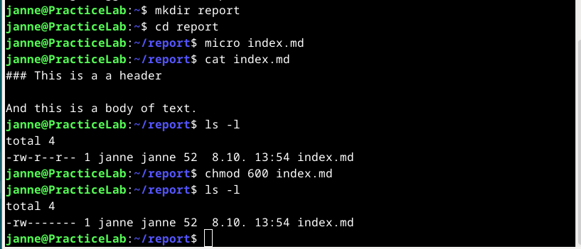

	
### d) 'howdy'

- *Tee kaikkien käyttäjien käyttöön komento 'howdy'*
- *Tulosta haluamaasi ajankohtaista tietoa, esim päivämäärä, koneen osoite tms*
- *Pelkkä "hei maailma" ei riitä*
- *Komennon tulee toimia kaikilla käyttäjillä työhakemistosta riippumatta*

Aloitusaika: 00:04:15 / 02:40:00

Tein yksinkertaisen shell skriptin ja siirsin sen jaettujen skriptien kansioon /usr/local/bin ja annoin kaikille käyttäjille ajo-oikeudet.

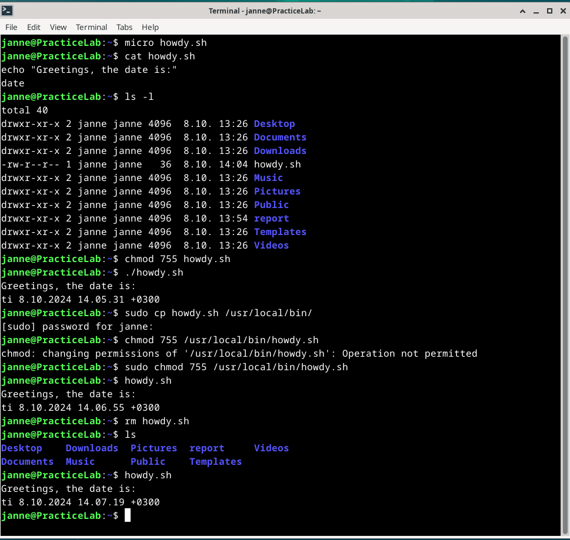

Tein uuden käyttäjän testaamiseen ja varmistin toiminnan tällä.

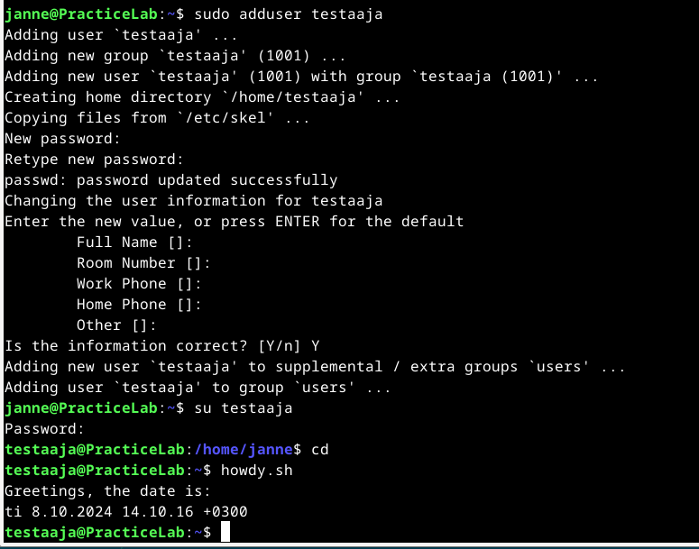

### e) Etusivu uusiksi

- *Asenna Apache-weppipalvelin*
- *Tee yrityksellemme "AI Kakone" kotisivu*
- *Kotisivu tulee näkyä koneesi IP-osoitteella suoraan etusivulla*
- *Sivua pitää päästä muokkaamaan normaalin käyttäjän oikeuksin (ilman sudoa). Liitä raporttiisi listaus tarvittavien tiedostojen ja kansioiden oikeuksista.*

Aloitusaika: 00:14:17 / 02:40:00

Asensin apachen ja poistin oletussivun käytöstä, jonka jälkeen tein uuden kansion ja index.html tiedoston käyttäjän kotihakemistoon ja uuden virtualhostin käyttämään tätä kansiota.

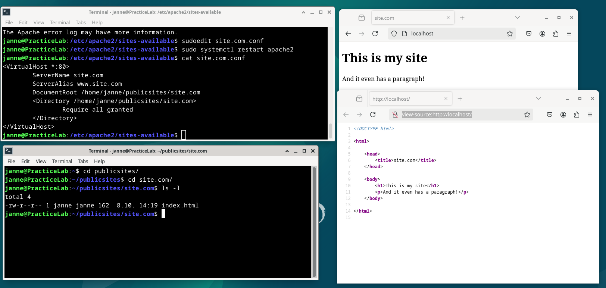

### g) Salattua hallintaa

- *Asenna ssh-palvelin*
- *Tee uusi käyttäjä omalla nimelläsi, esim. minä tekisin "Tero Karvinen test", login name: "terote01"*
- *Automatisoi ssh-kirjautuminen julkisen avaimen menetelmällä, niin että et tarvitse salasanoja, kun kirjaudut sisään. Voit käyttää kirjautumiseen localhost-osoitetta*

Aloitusaika: 00:40:52 / 02:40:00

- `$ sudo apt-get isntall ssh`
- `$ ssh-keygen`
- `$ sudo adduser janne01`
- `$ ssh-copy-id janne01@locahost`
- `$ ssh janne01@localhost`

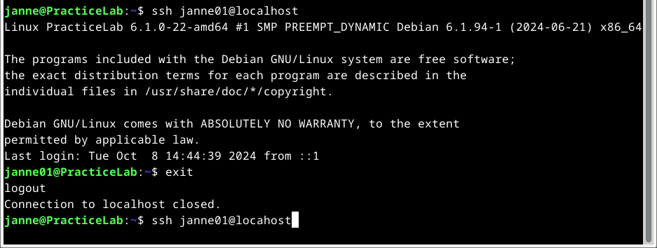

### h) Djangon lahjat

- *Asenna omalle käyttäjällesi Django-kehitysympäristö*
- *Tee tietokantaan lista tekoälyistämme, jossa on nämä ominaisuudet*
	- *Kirjautuminen salasanalla*
	- *Tietokannan muokkaus wepissä Djangon omalla ylläpitoliittymällä (Django admin)*
	- *Käyttäjä Erkille, jossa ei ole ylläpito-oikeuksia*
	- *Taulu Assistants, jossa jokaisella tietueella on nimi (name)*
	- *Jos haluat, voit lisäksi bonuksena laittaa mukaan kentän koko (size)*

Aloitusaika: 00:52:20 / 02:40:00

Asensin virtuaaliympäristön komennolla `$ sudo apt-get virtualenv` ja tein sinne uuden django projektin practice, johon tein yhden pääkäyttäjän, yhden peruskäyttäjän nimeltä Erkki ja appin nimellä testing, joka tuottaa Assistants taulun tietokantaan.

Lisäsin vielä esimerkki Assistantin nimellä Asdf.

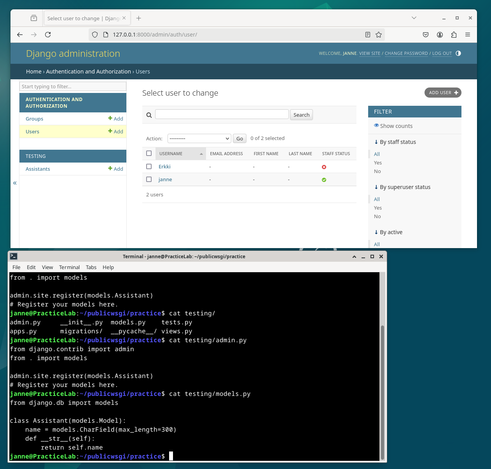

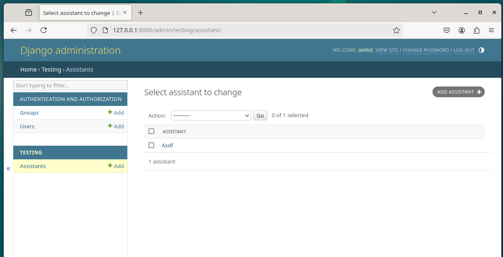

### h) Tuotantopropelli

- *Jos olet tässä kohdassa, olet kyllä työskennellyt todella nopeasti (tai sitten teet tätä tehtävää huviksesi kurssin jälkeen). Mutta älä huoli, tässä haastetta, jotta et joudu pyörittelemään peukaloita.*
- *Tee tuotantotyyppinen asennus Djangosta*
- *Laita Django-lahjatietokanta tuotantotyyppiseen asennukseen*
- *Voit vaihtaa tämän sivun näkymään etusivulla staattisen sivun sijasta*

Aloitusaika: 01:53:10 / 02:40:00

Asensin wsgi:n komennolla `$ sudo apt-get -y install libapache2-mod-wsgi-py3`, tein static hakemiston, tein virtual hostin, uudelleenkäynnistin apachen ja testasin toiminnan.

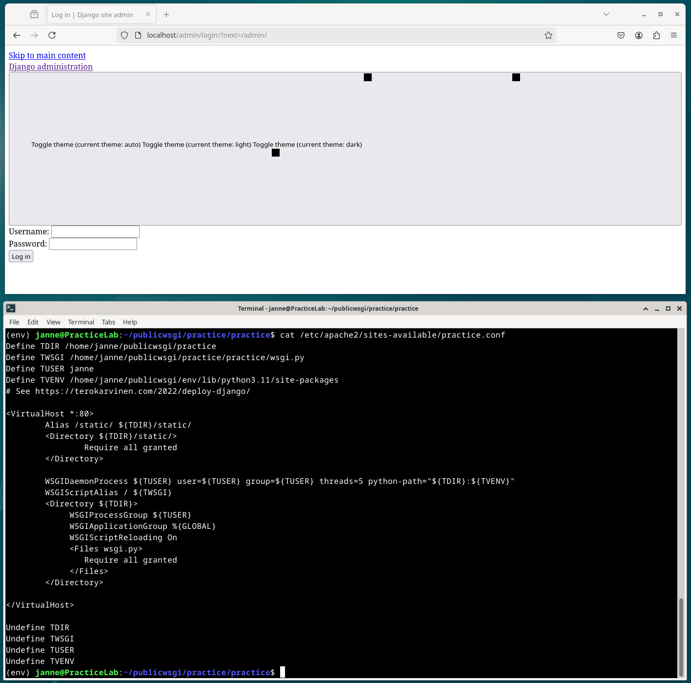

Poistin debuggauksen ja määrittelin hyväksytyt hostit.

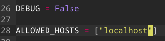

Määrittelin tyylit lisäämällä `import os` ja `STATIC_ROOT = os.path.join(BASE_DIR, 'static/')` rivit settings.py tiedostoon ja ajoin `$ ./manage.py collectstatic` niiden aktivointiin, jonka jälkeen testasin tyylien päivittyneen.

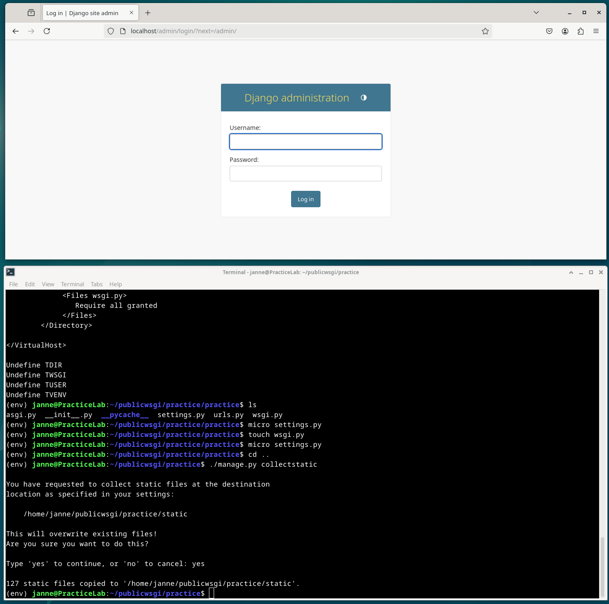

Päätin lopettaa tähän ja käyttää lopun ajasta b kohdan täyttämiseen.

Lopetusaika: 02:22:23 / 02:40:00

## Lähteet

Baeldung.com. Install custom bash scripts. https://www.baeldung.com/linux/install-custom-bash-scripts

Geeksforgeeks.org. C Program to Print the Program Name and All its Arguments. https://www.geeksforgeeks.org/c-program-to-print-the-program-name-and-all-its-arguments/

Geegksforgeeks.org. How to create a shell script in Linux. https://www.geeksforgeeks.org/how-to-create-a-shell-script-in-linux/

Geeksforgeeks.org. Printf in C. https://www.geeksforgeeks.org/printf-in-c/

Karvinen. T. 2024. Final Lab for Linux Palvelimet 2024 Spring. https://terokarvinen.com/2024/arvioitava-laboratorioharjoitus-2024-linux-palvelimet/

Karvinen, T. 2024. h7 Maalisuora. https://terokarvinen.com/linux-palvelimet/#h7-maalisuora
